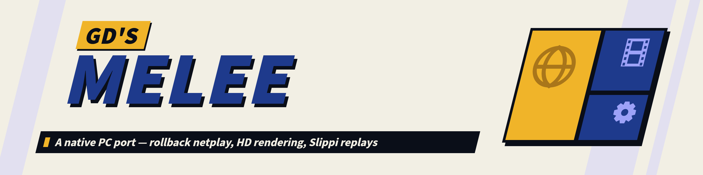

# GD's Melee

<p align="center">
  <picture>
    <source media="(prefers-color-scheme: dark)" srcset="docs/readme/banner_dark@2x.png">
    <source media="(prefers-color-scheme: light)" srcset="docs/readme/banner_light@2x.png">
    
  </picture>
</p>


A native PC port of *Super Smash Bros. Melee* (NTSC 1.02, `GALE01`), built **from the matching
decompilation** rather than by emulation or by recompiling the retail binary.

> **Status: first shareable beta.** It boots, renders in HD, plays VS matches with audio,
> cutscenes, memory-card saves and GameCube-adapter input at a hard 60 Hz - and now plays **online
> with rollback netcode** from an in-game ONLINE PLAY menu, plays back **Slippi replays**
> frame-accurately, and runs **m-ex** builds. Expect rough edges: see Known issues below.

<table>
  <tr>
    <td><picture>
      <source media="(prefers-color-scheme: dark)" srcset="docs/readme/feature_rollback_dark.png">
      
    </picture></td>
    <td><picture>
      <source media="(prefers-color-scheme: dark)" srcset="docs/readme/feature_hd_dark.png">
      
    </picture></td>
  </tr>
  <tr>
    <td><picture>
      <source media="(prefers-color-scheme: dark)" srcset="docs/readme/feature_replays_dark.png">
      
    </picture></td>
    <td><picture>
      <source media="(prefers-color-scheme: dark)" srcset="docs/readme/feature_mex_dark.png">
      
    </picture></td>
  </tr>
  <tr>
    <td><picture>
      <source media="(prefers-color-scheme: dark)" srcset="docs/readme/feature_ucf_dark.png">
      
    </picture></td>
    <td><picture>
      <source media="(prefers-color-scheme: dark)" srcset="docs/readme/feature_determinism_dark.png">
      
    </picture></td>
  </tr>
</table>

## Play online (beta)

Build the shareable package with `powershell -File tools
etplay\make_package.ps1` - it writes
`GDMelee-Online.zip` to the Desktop (the game, the menu art and a launcher; no disc data). Both
players use the same package and each supplies their own NTSC 1.02 ISO. In game: **VS Mode >
Melee > Match Setup > Online Play** - the host presses *Host Match* (its code is copied to the
clipboard), the guest pastes it and presses *Connect*. Full instructions, including what to do
when a router blocks the connection, are in
[`tools/netplay/HOW TO PLAY ONLINE.txt`](tools/netplay/HOW%20TO%20PLAY%20ONLINE.txt).

### Known issues (beta)

- One match per connection: after a match, Host / Connect again for a rematch.
- The results screen can show wrong stats after an online match.
- Only the main-menu tree, Match Setup and Online Play use the new menus; character select, stage
  select, rules and the other screens are still Melee's own.
- Three native Melee screens crash in the port (Options > Rumble, Erase Data, Records > VS.
  Records) - with or without the new menus.
- Online play has been tested between two copies on one machine (including simulated lag and
  packet loss); a real two-network session is the next test.

## What this is

Most "Melee on PC" efforts are either emulation (Dolphin + Slippi) or static recompilation of the
retail binary. This project takes a third road — **compiled decompilation**:

- [`doldecomp/melee`](https://github.com/doldecomp/melee) is a matching decompilation of Melee in
  which every game translation unit is real C that reproduces the original PowerPC behavior.
- Those translation units are retargeted to x86 by `pc/tools/gwtool`: clang's PPC front-end emits
  LLVM IR, and gwtool rewrites every memory access to be big-endian, prefixes every symbol with
  `gw_`, and emits x86 COFF. The result links against a native platform layer.
- The GameCube SDK surface (GX, OS, PAD, CARD, AX, DVD, AR, …) is replaced by native shims over
  [Aurora](https://github.com/encounter/aurora) (a GC/Wii SDK reimplementation on top of
  [Dawn](https://dawn.googlesource.com/dawn)), so rendering goes straight to D3D12 with no emulated
  GPU. Where the SDK's own decompiled source is worth keeping, it is built as a translation unit
  like any other — the THP video decoder is, with its Gekko paired-single IDCT rewritten in
  portable C.

The payoff over static recompilation is a **fully editable game** — every line of engine code is C
you can change. The price is that all ~980 translation units must be made correct by hand, which is
where most of the engineering goes (see the GC-layout alias-view class in the devlog).

## Status

| Area | State |
|---|---|
| Boot → title → VS match | working |
| Rendering (GX → D3D12 via Aurora/Dawn) | working |
| Audio (own AX / DSP-ADPCM mixer over SDL3) | working, incl. both aux buses + AXFX reverb/delay |
| Cutscenes (THP video, own decoder) | working |
| Memory-card saves (GCI) | working |
| GameCube adapter input | working |
| Frame pacing | hard 60 Hz (p50 = 16.67 ms, p95 = 16.9 ms) |
| Attract mode | 300 s, zero fatal errors |
| Netplay / replays / launcher / packaging | not started |
| Widescreen / upscaling / high-framerate sim | not started |

## Repository layout

```
docs/DEVLOG.md        engineering log: every hard-won fact, bug and fix (read this first)
docs/HANDOFF.md       current state + next experiment for stage authoring (resume here)
PORT_BOOTSTRAP.md     project origin and the feasibility analysis
_research/            boot gates, SDK/console invariants, shim surface, port dev quickref
_build/               Windows build scripts (Aurora, per-TU pipeline, link, run)
_research/scripts/    research tooling (e.g. count_constructs.py)
DEPENDENCIES.md       every third-party component, its version/pin, and its licence
```

The port source itself lives in the `melee` fork of `doldecomp/melee`, on the `pc-port` branch,
under `pc/` (`pc/platform` shims, `pc/gameworld`, `pc/tools/gwtool`). That fork is the buildable
project; this repository carries the tooling, research and engineering log around it.

## Building

Host is Windows with WSL, MSVC Build Tools, clang 23, and CMake/Ninja for Aurora. The exact,
maintained commands are in [`_research/port-dev-quickref.md`](_research/port-dev-quickref.md). In
short:

1. Build Aurora + Dawn + SDL3 — `_build/build_aurora_melee.bat`.
2. Compile every game translation unit through the retarget pipeline — `_build/masstest/pipe_wsl.sh`,
   driven by the manifest `_build/masstest/files.txt`.
3. Link `melee-pc.exe` — `_build/build_melee_pc.bat`.
4. Run it against your own disc image: `melee-pc.exe --iso <path to GALE01 v1.02>`.

## Legal

- **No copyrighted material is included.** You must supply your own legally dumped ISO of
  *Super Smash Bros. Melee* (NTSC 1.02). No ROM, no game assets and no Nintendo SDK code are
  distributed here.
- Not affiliated with, endorsed by or sponsored by Nintendo. *Super Smash Bros.* and *Melee* are
  trademarks of Nintendo.
- The underlying decompilation is a pre-existing, openly published, research-oriented effort.
- The port is licensed **GPL-2.0-or-later** — see [`LICENSE`](LICENSE).

## Credits

- [doldecomp/melee](https://github.com/doldecomp/melee) — the decompilation this is built on.
- [encounter/aurora](https://github.com/encounter/aurora) — GC/Wii SDK reimplementation.
- [google/dawn](https://dawn.googlesource.com/dawn) — WebGPU implementation.
- [TwilitRealm/dusklight](https://github.com/TwilitRealm/dusklight) — precedent for turning a
  GameCube decomp into a native cross-platform port.
- [akaneia/m-ex](https://github.com/akaneia/m-ex) and its contributors — the content-expansion
  framework whose patches are used as the **specification** for behaviors reimplemented in the
  port (no m-ex source is vendored or built; see
  [`DEPENDENCIES.md`](DEPENDENCIES.md#specification-references-not-built)).
- Dolphin Emulator — `pc/gameworld/gekko_fp.c` derives from `Common/FloatUtils.cpp`
  (GPL-2.0-or-later); attribution is in that file.
