# GD's Melee

<p align="center">
  <picture>
    <source media="(prefers-color-scheme: dark)" srcset="docs/readme/brand/logo_horizontal_dark.png">
    <source media="(prefers-color-scheme: light)" srcset="docs/readme/brand/logo_horizontal_light.png">
    
  </picture>
</p>

<p align="center">
  <a href="https://github.com/GurekamDhillon/gd-melee-workspace/releases/latest"></a>
  
  
  
  
  <a href="LICENSE"></a>
</p>

<p align="center">
  <a href="docs/readme/gameplay.mp4">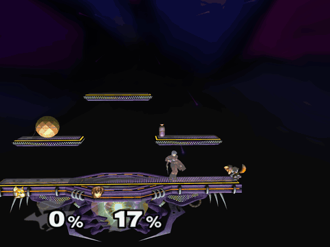</a><br>
  <sub>Real gameplay, captured frame by frame from the game's own screenshot hook. <a href="docs/readme/gameplay.mp4">MP4 version</a>.</sub>
</p>

A native PC port of *Super Smash Bros. Melee* (NTSC 1.02, `GALE01`), built **from the matching
decompilation** rather than by emulation or by recompiling the retail binary. It plays online with
**rollback netcode** from a competitive lobby, renders natively in HD, runs **m-ex** mod discs and
loose mods, and can be scripted in **Lua**.

> **Status: public test build (0.1.4).** Expect rough edges and please report bugs: what you did,
> which disc, and the crash report from the `crashlogs` folder (or `melee-pc.log`).

## Quick start

<p><a href="https://github.com/GurekamDhillon/gd-melee-workspace/releases/latest">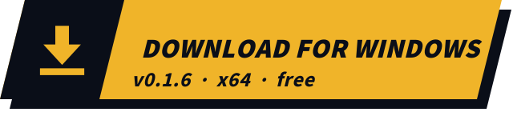</a></p>

1. **Download** the latest `GDMelee-<version>-win64.zip` from
   [Releases](https://github.com/GurekamDhillon/gd-melee-workspace/releases/latest) and unzip it anywhere.
2. **Point it at your own disc.** Start `GD Melee.exe`, click *Add disc...* and pick your own
   legally dumped *Melee* NTSC 1.02 `.iso` (mod discs such as ACE or Akaneia work too). No game data
   ships with the port.
3. **Play.** Press *PLAY*. For online play: **Versus > Online Play**, then host a room and send the
   code, join one, or press *Random Opponent*.

The launcher is in English and Spanish (it follows Windows by default; English or Spanish can be chosen in the launcher).
Windows SmartScreen warns on first run because the launcher isn't code-signed.

## Features

<table>
  <tr>
    <td><picture>
      <source media="(prefers-color-scheme: dark)" srcset="docs/readme/feature_rollback_dark.png">
      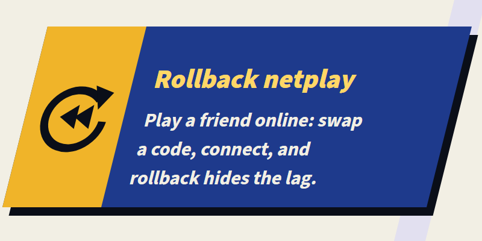
    </picture></td>
    <td><picture>
      <source media="(prefers-color-scheme: dark)" srcset="docs/readme/feature_lobby_dark.png">
      
    </picture></td>
  </tr>
  <tr>
    <td><picture>
      <source media="(prefers-color-scheme: dark)" srcset="docs/readme/feature_hd_dark.png">
      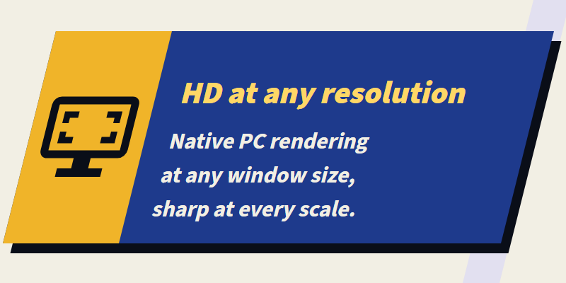
    </picture></td>
    <td><picture>
      <source media="(prefers-color-scheme: dark)" srcset="docs/readme/feature_mex_dark.png">
      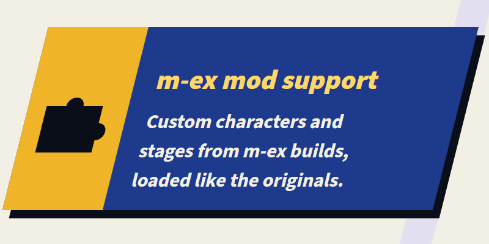
    </picture></td>
  </tr>
  <tr>
    <td><picture>
      <source media="(prefers-color-scheme: dark)" srcset="docs/readme/feature_roster_dark.png">
      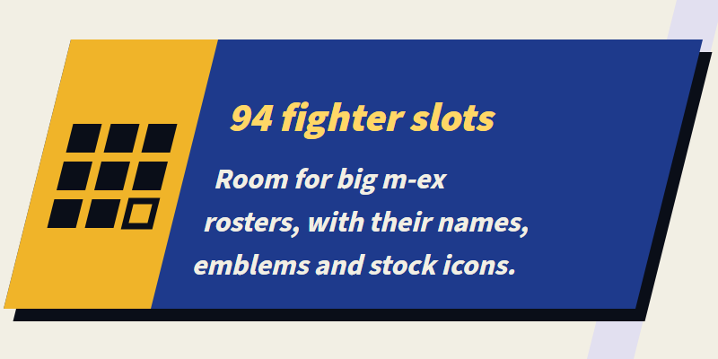
    </picture></td>
    <td><picture>
      <source media="(prefers-color-scheme: dark)" srcset="docs/readme/feature_scripting_dark.png">
      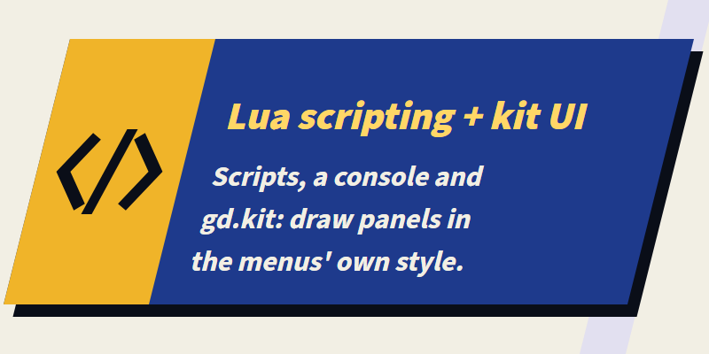
    </picture></td>
  </tr>
  <tr>
    <td><picture>
      <source media="(prefers-color-scheme: dark)" srcset="docs/readme/feature_training_dark.png">
      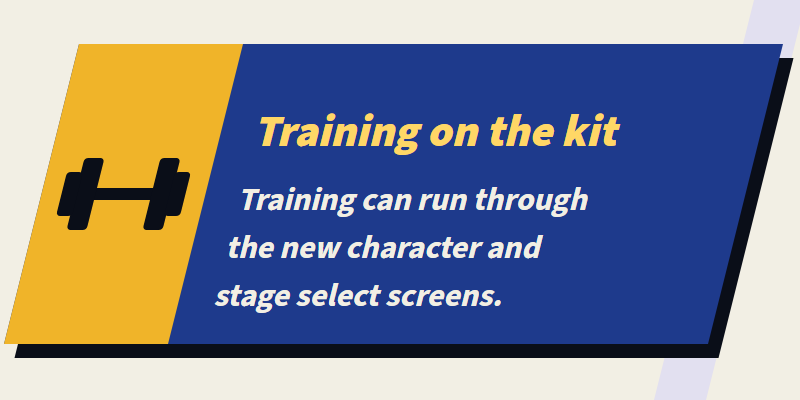
    </picture></td>
    <td><picture>
      <source media="(prefers-color-scheme: dark)" srcset="docs/readme/feature_launcher_dark.png">
      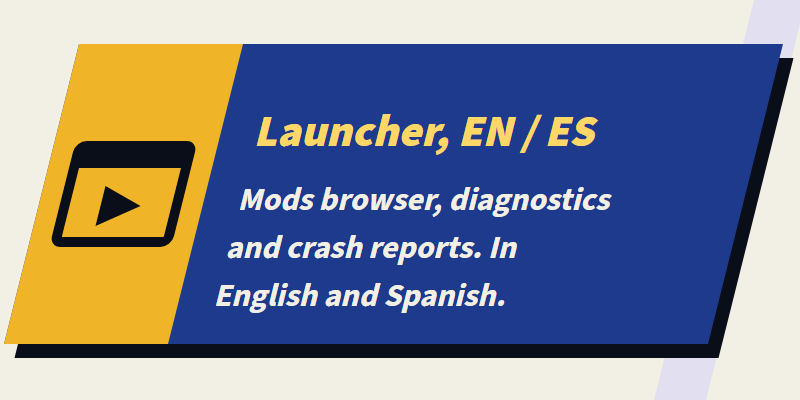
    </picture></td>
  </tr>
  <tr>
    <td><picture>
      <source media="(prefers-color-scheme: dark)" srcset="docs/readme/feature_replays_dark.png">
      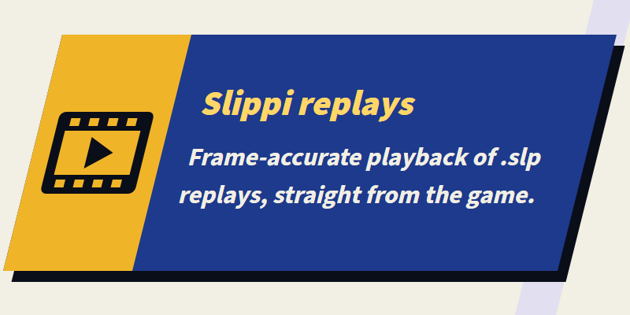
    </picture></td>
    <td><picture>
      <source media="(prefers-color-scheme: dark)" srcset="docs/readme/feature_settings_dark.png">
      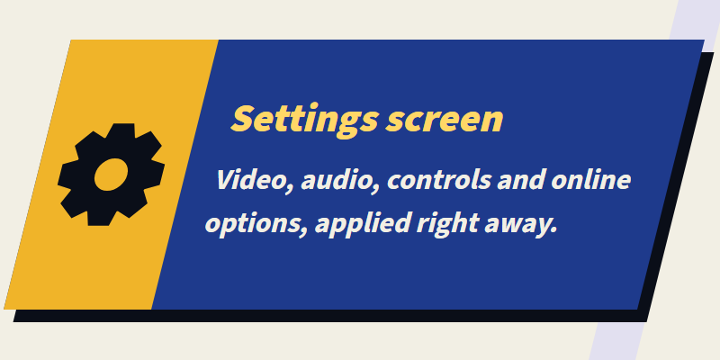
    </picture></td>
  </tr>
  <tr>
    <td><picture>
      <source media="(prefers-color-scheme: dark)" srcset="docs/readme/feature_ucf_dark.png">
      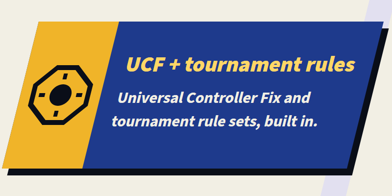
    </picture></td>
    <td><picture>
      <source media="(prefers-color-scheme: dark)" srcset="docs/readme/feature_determinism_dark.png">
      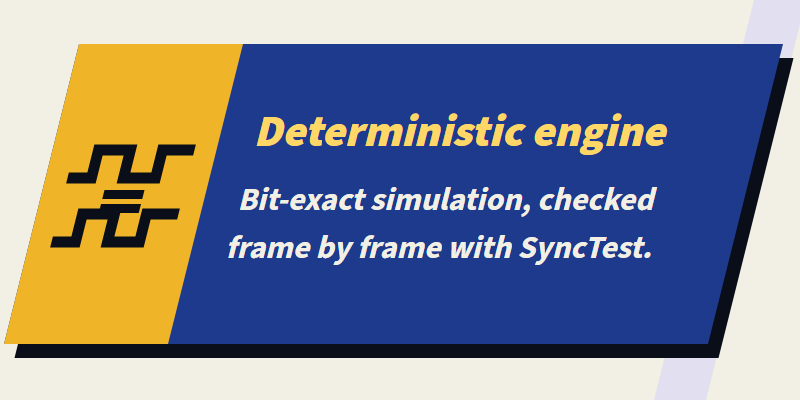
    </picture></td>
  </tr>
</table>

### Everything in 0.1.4

**Online**
- Rollback netcode. Play a friend with a short room code, or press **Random Opponent** to be paired
  with anyone searching.
- A competitive lobby in the same room: blind character picks, stage strikes and bans, ready-up and
  rematches, with the set score kept.
- Stages are split into **starters** (Battlefield, Final Destination, Dream Land, Yoshi's Story,
  Fountain of Dreams) and a **counterpick** (Pokémon Stadium). Game 1 strikes over the starters
  1-2-1; the counterpick opens from game 2 for bans and picks.
- The strike cursor skips struck and banned stages in every direction, with wrap-around.
- Sheik can be picked online (press A on Zelda again), and mods work online: you can pick any
  fighter or stage both players have.
- The GameCube adapter follows the window you're using and is only held in the background during an
  online match.

**Mods (m-ex)**
- Mod discs (ACE, Akaneia) and loose mods in the `mods` folder, toggled in the launcher. The
  launcher's Mods tab browses and installs mods; downloads are verified and never run.
- **94 m-ex fighter slots** (up from 31), so big rosters fit.
- The results screen shows m-ex fighters' names, emblems and stock icons.
- m-ex CPUs play from their clone base's CPU tables.

**Menus and screens**
- New main menu, hubs, character select and stage select that list every fighter and stage your
  disc and mods provide, with pages for big rosters.
- **Training can run through the new character and stage select** (`gd.training_select("kit")`,
  or `select=kit` in the scene grammar).
- A **Settings** screen: video, audio, controls, online name and server, mods and gameplay options,
  applied right away and saved.
- Everything unlocked from the start, without a save file (always on online).

**Graphics and input**
- Native D3D12 rendering at any render scale, vsync off, and an experimental uncapped frame rate.
- About 13 ms from controller to screen, steadily.
- GameCube adapter (plug in any time, clones supported), keyboard and controllers together by
  default.

**Scripting**
- Lua scripts and a console (the backtick key). Scripts can read the match, draw, wait on the game,
  add console commands, and, if they declare it, drive gameplay (rollback-safe).
- **`gd.kit`**: scripts draw with the menus' own kit (9-slice panels, the kit's fonts and text
  roles, list rows, icons, the palette) over any scene, a match included. Mods can ship their own
  kit art.
- Built-in examples: `tm_lite` (save/load positions on F5-F8), `state_overlay` (frame data),
  `kit_hud`, `scene_setup`. See [`docs/scripting.md`](docs/scripting.md).

**Launcher and reports**
- English and Spanish; the language follows Windows by default.
- Diagnostics tab, short logs, and crash reports with your Windows user name removed. Optional crash
  report upload, off by default; nothing is ever sent automatically.

## Screenshots

All captured from the running port (1280x960 window unless noted).

<table>
  <tr>
    <td width="50%">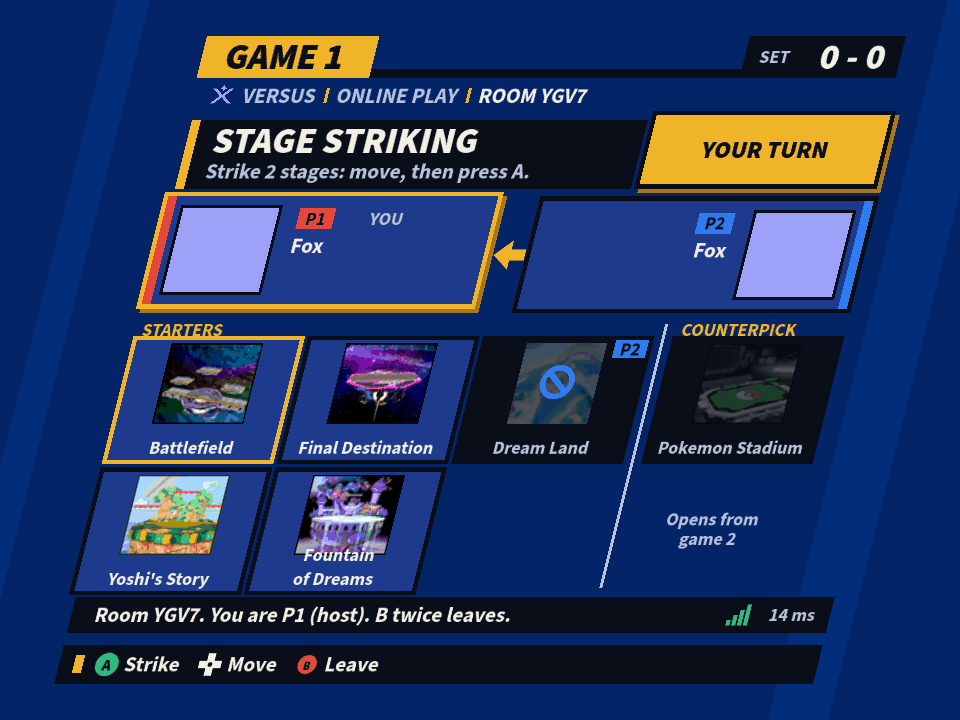</td>
    <td width="50%">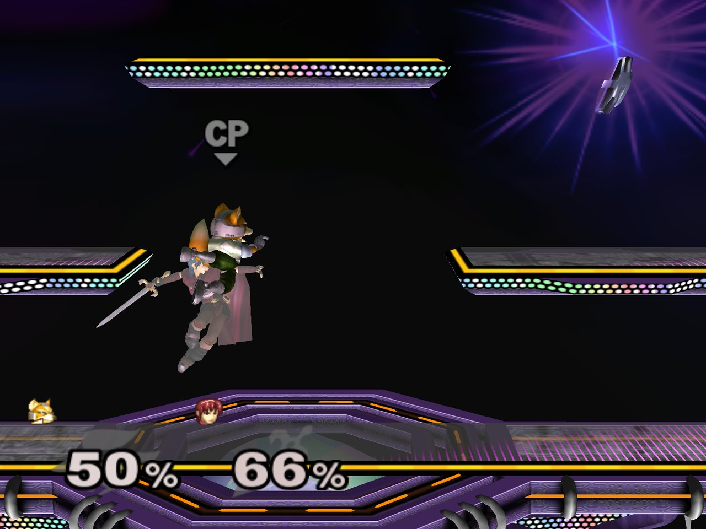</td>
  </tr>
  <tr>
    <td>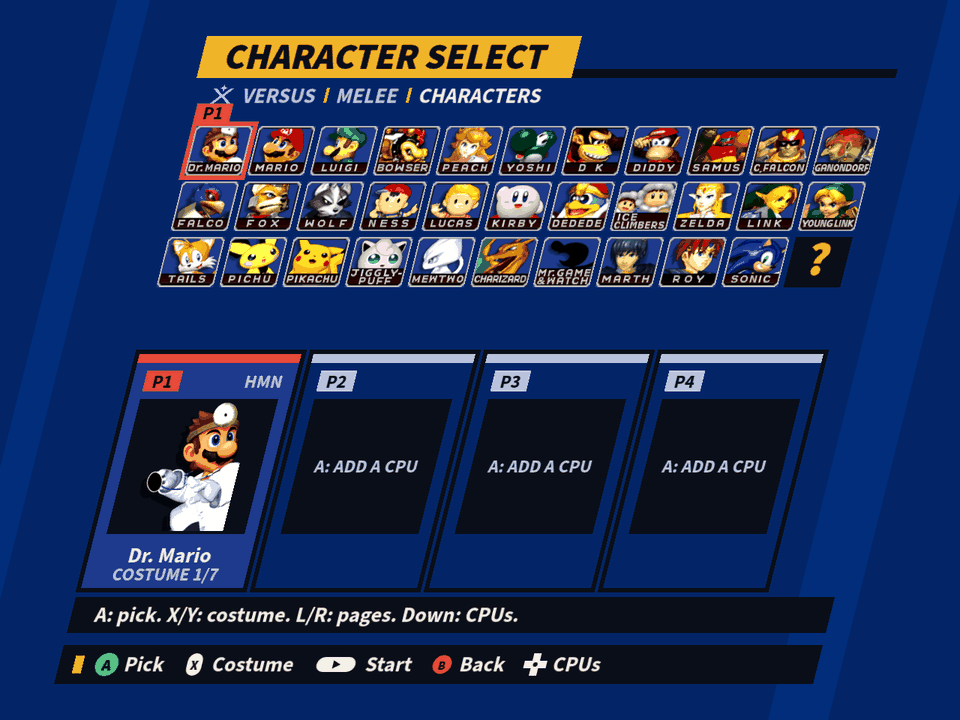</td>
    <td>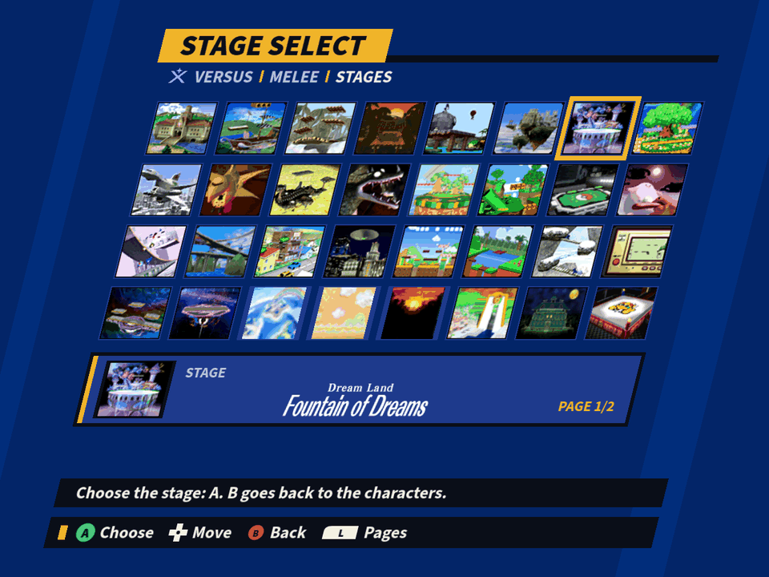</td>
  </tr>
  <tr>
    <td>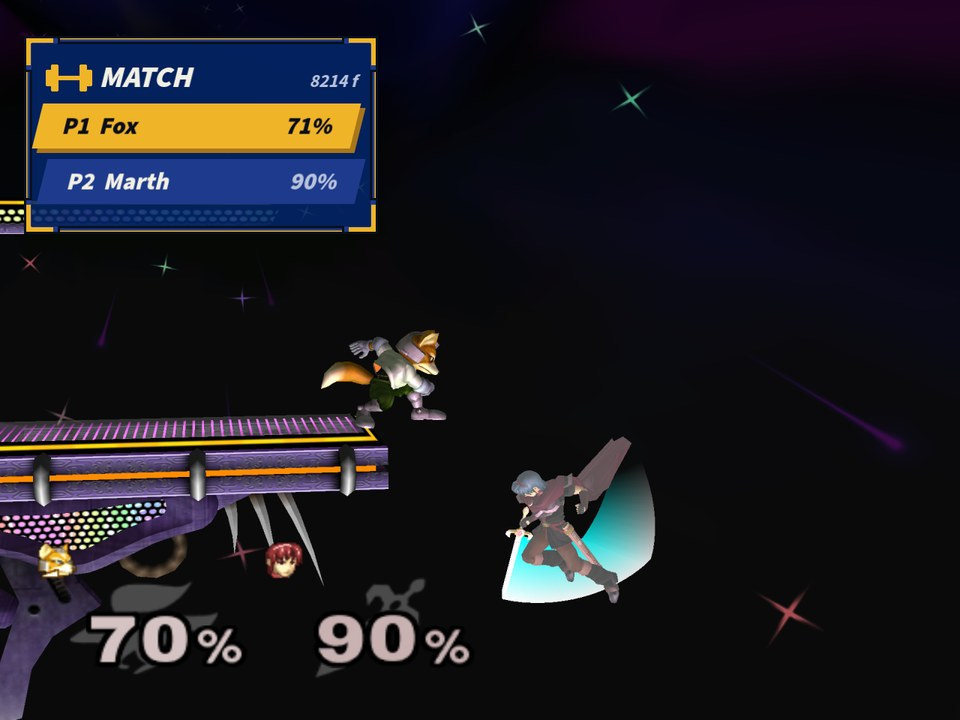</td>
    <td>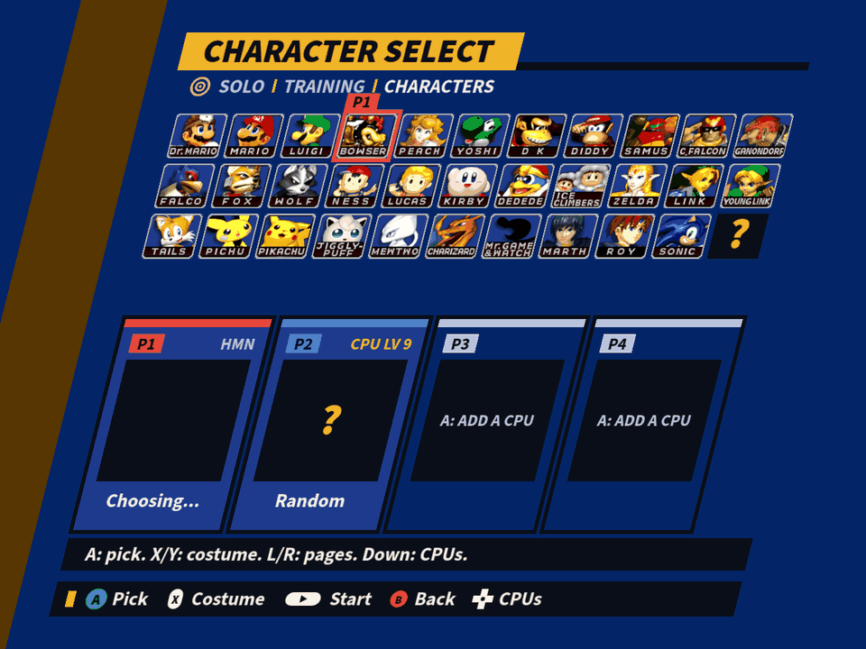</td>
  </tr>
  <tr>
    <td>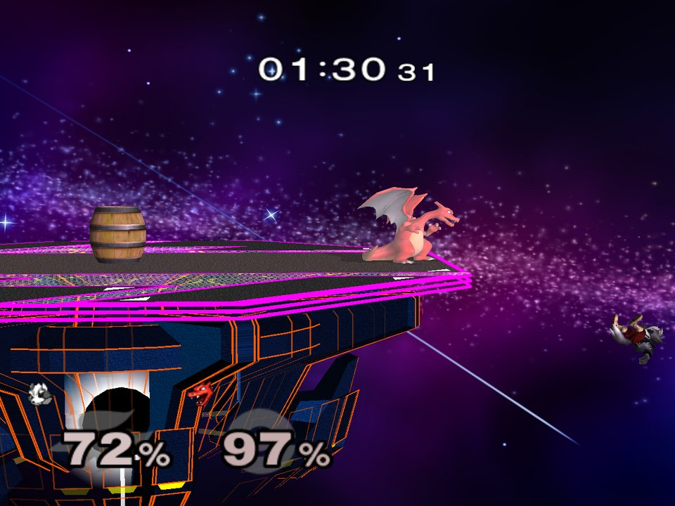</td>
    <td>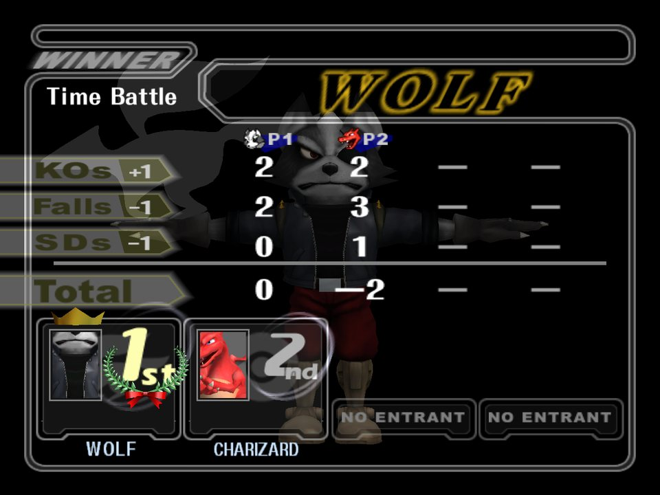</td>
  </tr>
  <tr>
    <td>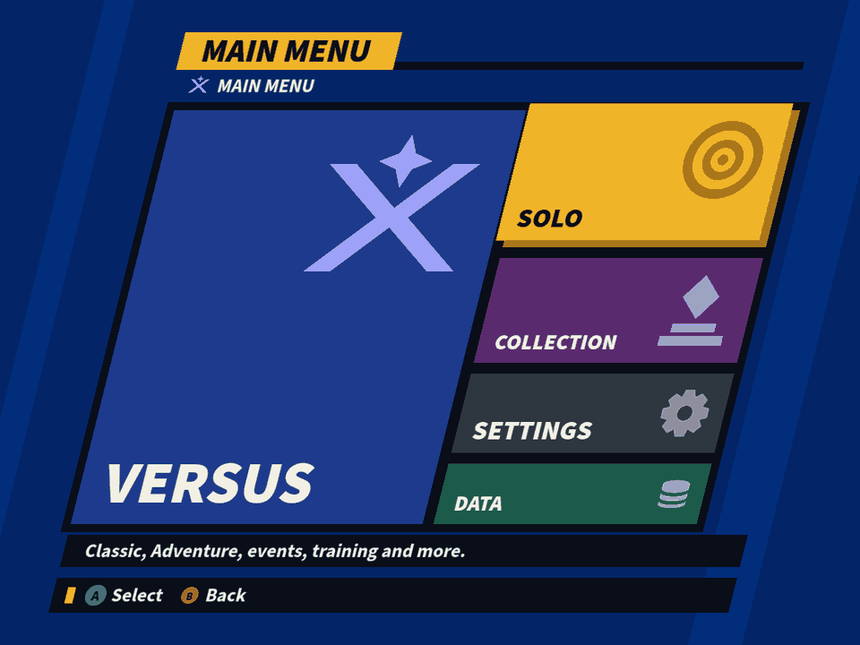</td>
    <td>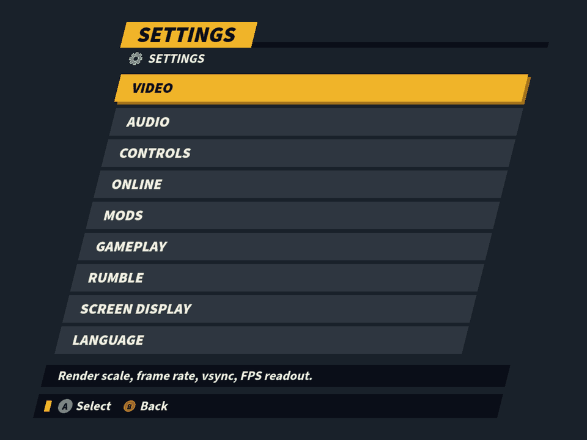</td>
  </tr>
  <tr>
    <td>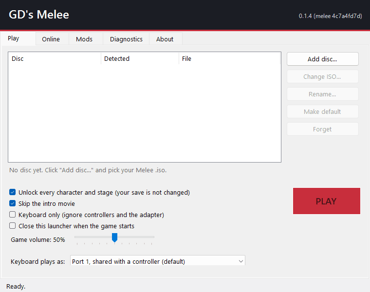</td>
    <td>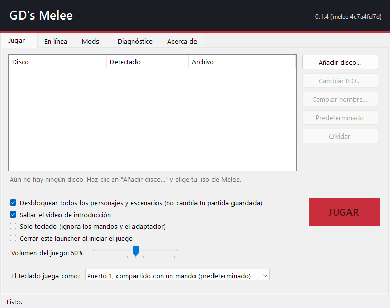</td>
  </tr>
</table>

## Coming soon: the Geno engine

Native fighter extensions beyond m-ex: new action states, new moves and behaviours, defined per
fighter in data. It stays 100% m-ex compatible and is opt-in per fighter, and everything it adds is
rollback-safe. It comes with the **Geno Lab**, a frame-data lab with hitbox and hurtbox overlays,
frame stepping and step-back, and a timeline.

## Known issues

- Training-mode features like UnclePunch's Training Mode aren't here yet; `tm_lite` is a small
  stand-in. TM-CE and 20XX discs boot, but their special features don't work.
- Fighter and stage mods from different packs (for example ACE fighters with Akaneia stages) can't
  be mixed yet.
- The uncapped frame rate is experimental: the picture trails the game by one frame.
- Teams mode on the new character select isn't finished, and 4-player local matches have had little
  testing.
- On a 144 Hz monitor, 60 fps looks uneven. Set the display to 120 Hz, or turn on G-Sync/FreeSync.

Each release's notes are in [`tools/release/notes/`](tools/release/notes/).

## What this is

Most "Melee on PC" efforts are either emulation (Dolphin + Slippi) or static recompilation of the
retail binary. This project takes a third road — **compiled decompilation**:

- [`doldecomp/melee`](https://github.com/doldecomp/melee) is a matching decompilation of Melee in
  which every game translation unit is real C that reproduces the original PowerPC behavior.
- Those translation units are retargeted to x86 by `pc/tools/gwtool`: clang's PPC front-end emits
  LLVM IR, and gwtool rewrites every memory access to be big-endian, prefixes every symbol with
  `gw_`, and emits x86 COFF. The result links against a native platform layer.
- The GameCube SDK surface (GX, OS, PAD, CARD, AX, DVD, AR, …) is replaced by native shims over
  [Aurora](https://github.com/encounter/aurora) (a GC/Wii SDK reimplementation on top of
  [Dawn](https://dawn.googlesource.com/dawn)), so rendering goes straight to D3D12 with no emulated
  GPU. Where the SDK's own decompiled source is worth keeping, it is built as a translation unit
  like any other — the THP video decoder is, with its Gekko paired-single IDCT rewritten in
  portable C.
- m-ex content ships PowerPC code inside its data files; the port runs those blobs through a small
  PowerPC interpreter and bridges their calls back to its own native functions.

The payoff over static recompilation is a **fully editable game** — every line of engine code is C
you can change. The price is that all ~980 translation units must be made correct by hand, which is
where most of the engineering goes (see the devlog).

## Status

| Area | State |
|---|---|
| Boot → menus → VS match, Training | working |
| Rendering (GX → D3D12 via Aurora/Dawn), any render scale | working |
| Audio (own AX / DSP-ADPCM mixer over SDL3) | working, incl. both aux buses + AXFX reverb/delay |
| Cutscenes (THP video, own decoder) | working |
| Memory-card saves (GCI) | working |
| GameCube adapter, keyboard | working |
| Frame pacing | hard 60 Hz; experimental uncapped frame rate |
| Rollback netplay + competitive lobby | public test |
| Slippi replay playback | working |
| m-ex discs and loose mods (94 fighter slots) | public test |
| Lua scripting + console | working (API 1) |
| Launcher, release packaging | public test (0.1.4) |
| Widescreen | not started |

## Repository layout

```
docs/DEVLOG.md        engineering log: every hard-won fact, bug and fix (read this first)
docs/HANDOFF.md       current state + next experiment (resume here)
docs/scripting.md     the Lua scripting API, the console and the examples
PORT_BOOTSTRAP.md     project origin and the feasibility analysis
_research/            boot gates, SDK/console invariants, shim surface, port dev quickref
_build/               Windows build scripts (Aurora, per-TU pipeline, link, run)
tools/port/           build.sh (build + bridge fixpoint), run.sh (sandboxed runs)
tools/release/        the launcher, release build/check/publish scripts, release notes
tools/netplay/        the matchmaking server and netplay test drivers
DEPENDENCIES.md       every third-party component, its version/pin, and its licence
```

The port source itself lives in the `melee` fork of `doldecomp/melee`, on the
[`pc-port`](https://github.com/GurekamDhillon/melee/tree/pc-port) branch, under `pc/`
(`pc/platform` shims, `pc/gameworld`, `pc/tools/gwtool`). That fork is the buildable project; this
repository carries the tooling, launcher, research and engineering log around it.

## Building

Host is Windows with WSL, MSVC Build Tools, clang 23, and CMake/Ninja for Aurora. The exact,
maintained commands are in [`_research/port-dev-quickref.md`](_research/port-dev-quickref.md). In
short:

1. Build Aurora + Dawn + SDL3 — `_build/build_aurora_melee.bat`.
2. Build `melee-pc.exe` — `tools/port/build.sh` compiles changed translation units through the
   retarget pipeline, links, and regenerates the m-ex bridge until it is a fixpoint.
3. Run it against your own disc image — `tools/port/run.sh <name> --iso <path to GALE01 v1.02>`.
4. Package a release — see [`tools/release/README.md`](tools/release/README.md).

## Legal

- **No copyrighted material is included.** You must supply your own legally dumped ISO of
  *Super Smash Bros. Melee* (NTSC 1.02). No ROM, no game assets and no Nintendo SDK code are
  distributed here. The screenshots show the port running on the author's own discs.
- Not affiliated with, endorsed by or sponsored by Nintendo. *Super Smash Bros.* and *Melee* are
  trademarks of Nintendo.
- The underlying decompilation is a pre-existing, openly published, research-oriented effort.
- The port is licensed **GPL-2.0-or-later** — see [`LICENSE`](LICENSE).

## Credits

- [doldecomp/melee](https://github.com/doldecomp/melee) — the decompilation this is built on.
- [encounter/aurora](https://github.com/encounter/aurora) — GC/Wii SDK reimplementation.
- [google/dawn](https://dawn.googlesource.com/dawn) — WebGPU implementation.
- [TwilitRealm/dusklight](https://github.com/TwilitRealm/dusklight) — precedent for turning a
  GameCube decomp into a native cross-platform port.
- [akaneia/m-ex](https://github.com/akaneia/m-ex) and its contributors — the content-expansion
  framework whose patches are used as the **specification** for behaviors reimplemented in the
  port (no m-ex source is vendored or built; see
  [`DEPENDENCIES.md`](DEPENDENCIES.md#specification-references-not-built)).
- Dolphin Emulator — `pc/gameworld/gekko_fp.c` derives from `Common/FloatUtils.cpp`
  (GPL-2.0-or-later); attribution is in that file.
