# GD's Melee

<p align="center">
  <picture>
    <source media="(prefers-color-scheme: dark)" srcset="docs/readme/brand/logo_horizontal_dark.png">
    <source media="(prefers-color-scheme: light)" srcset="docs/readme/brand/logo_horizontal_light.png">
    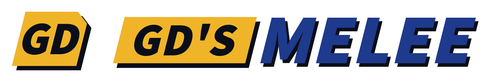
  </picture>
</p>

<p align="center">
  <a href="https://github.com/GurekamDhillon/gd-melee-workspace/releases/latest"></a>
  
  
  
  
  <a href="https://discord.gg/FU4KTGQS5m"></a>
  <a href="LICENSE"></a>
</p>

<p align="center">Join <a href="https://discord.gg/FU4KTGQS5m">GD's Workshop on Discord</a> for matchmaking, setup help, bug reports, and modding.</p>

<p align="center">
  <a href="docs/readme/gameplay.mp4">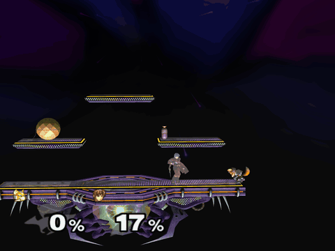</a><br>
  <sub>Real gameplay, captured frame by frame from the game's own screenshot hook. <a href="docs/readme/gameplay.mp4">MP4 version</a>.</sub>
</p>

A native PC port of *Super Smash Bros. Melee* (NTSC 1.02, `GALE01`), built **from the matching
decompilation** rather than by emulation or by recompiling the retail binary. It plays online with
**rollback netcode** from a competitive lobby, renders natively in HD, runs **m-ex** mod discs and
loose mods, and can be scripted in **Lua**.

> **Status: public test build (0.2.2).** Expect rough edges and please report bugs: what you did,
> which disc, and the crash report from the `crashlogs` folder (or `melee-pc.log`). Windows and
> Linux 0.2.2 play each other online; they do not play 0.2.1 or earlier, so both players update.

## Quick start

<p>
  <a href="https://github.com/GurekamDhillon/gd-melee-workspace/releases/latest">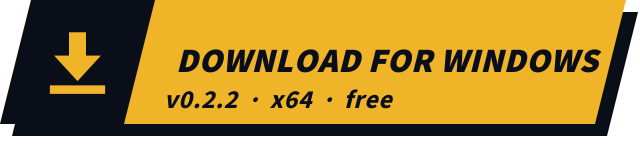</a>
  <a href="https://github.com/GurekamDhillon/gd-melee-workspace/releases/latest"></a>
</p>

1. **Download** the latest release from
   [Releases](https://github.com/GurekamDhillon/gd-melee-workspace/releases/latest) and unpack it
   anywhere: `GDMelee-<version>-win64.zip` on Windows, or
   `GDMelee-<version>-linux-x86_64.tar.xz` on Linux (`tar xf`, then run `./GD-Melee`).
2. **Point it at your own disc.** Start `GD Melee.exe` (Windows) or `./GD-Melee` (Linux), click
   *Add disc...* and pick your own legally dumped *Melee* NTSC 1.02 `.iso` (mod discs such as ACE or
   Akaneia work too). Nothing disc-derived is distributed with the port.
3. **Play.** Press *PLAY*. For online play: **VERSUS > ONLINE**, then host a room and send the
   code, join one, or press *Random Opponent*.

The launcher is in English and Spanish (it follows the system language by default; English or Spanish
can be chosen in the launcher). Windows SmartScreen warns on first run because the launcher isn't
code-signed. The Linux build is a 32-bit game on a 64-bit host and needs the distribution's 32-bit
runtime and Vulkan driver; the tarball's `README.txt` lists the packages. Press **F11** or
**Alt+Enter** for fullscreen.

## What's new in 0.2.x

Details for each release are in [`tools/release/notes/`](tools/release/notes/).

- **Linux, and Windows-vs-Linux play.** A native Linux x86_64 build with the same launcher, mods and
  online play; Windows and Linux players can match each other. Before a match both games compare a
  build id, and a mismatched build is refused instead of desyncing (0.2.0, fixed up in 0.2.2).
- **Online.** Rollback with room codes and a competitive lobby, a stricter disc check, sets that
  **resume after a disconnect** (or can be abandoned), tied games replayed instead of sudden death, and
  the Turbo match rule for private rooms. Rollback checks look at far more of the game, so a real
  desync is caught on the frame it starts.
- **Mod browser in the game (SSBM Nucleus).** Browse and search mods with thumbnails and filters, queue
  them (the queue survives a restart) and the game downloads and installs zip mods for you.
  Mods from SSBM Nucleus - https://ssbmnucleus.net, used with the permission of sc00p.
- **255 costumes per fighter**, so skins are no longer limited to the original palette slots.
- **Fullscreen** with F11 or Alt+Enter, and a Video setting.
- **Everything unlocked by default**: every fighter and stage from the start. Turn it off in
  Settings > Gameplay.
- **Envoy**, a roguelite on top of Classic and Adventure: pick a *drive* after each stage, carry four in
  a bag, take rare *keystones* with a drawback, and face tougher opponents that use technique against
  you. It ships on by default (SOLO > ENVOY; the launcher's Mods tab turns it off); two players can
  run it as offline co-op, or play an Envoy set in a private online room.
- **A new Qt launcher** for Windows and Linux with a Diagnostics tab, and opt-in crash report upload.
- **Linux fixes:** much faster rollback snapshots, the Turbo crashes fixed, and Envoy drive items,
  the crit shader and mod surface shaders now work. Elsewhere: a bad shader-cache entry can no longer
  stop the game from starting, and Data > Snapshots no longer freezes.

## Features

<table>
  <tr>
    <td><picture>
      <source media="(prefers-color-scheme: dark)" srcset="docs/readme/feature_rollback_dark.png">
      
    </picture></td>
    <td><picture>
      <source media="(prefers-color-scheme: dark)" srcset="docs/readme/feature_lobby_dark.png">
      
    </picture></td>
  </tr>
  <tr>
    <td><picture>
      <source media="(prefers-color-scheme: dark)" srcset="docs/readme/feature_hd_dark.png">
      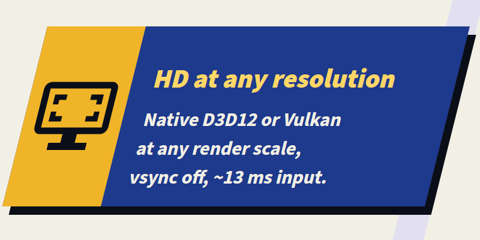
    </picture></td>
    <td><picture>
      <source media="(prefers-color-scheme: dark)" srcset="docs/readme/feature_mex_dark.png">
      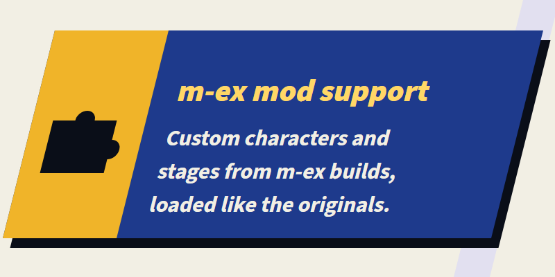
    </picture></td>
  </tr>
  <tr>
    <td><picture>
      <source media="(prefers-color-scheme: dark)" srcset="docs/readme/feature_roster_dark.png">
      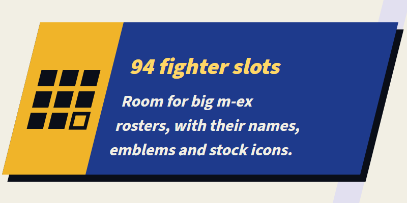
    </picture></td>
    <td><picture>
      <source media="(prefers-color-scheme: dark)" srcset="docs/readme/feature_scripting_dark.png">
      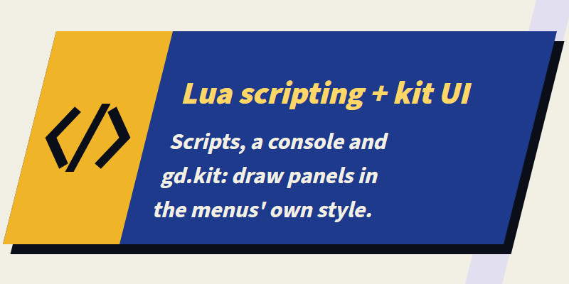
    </picture></td>
  </tr>
  <tr>
    <td><picture>
      <source media="(prefers-color-scheme: dark)" srcset="docs/readme/feature_training_dark.png">
      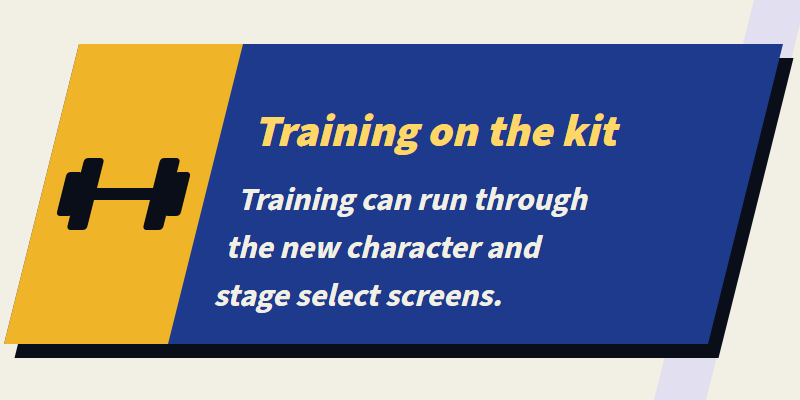
    </picture></td>
    <td><picture>
      <source media="(prefers-color-scheme: dark)" srcset="docs/readme/feature_launcher_dark.png">
      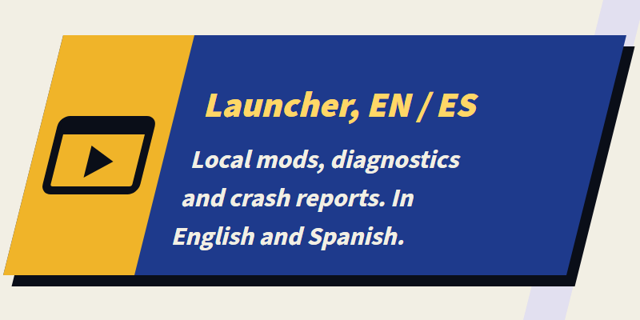
    </picture></td>
  </tr>
  <tr>
    <td><picture>
      <source media="(prefers-color-scheme: dark)" srcset="docs/readme/feature_replays_dark.png">
      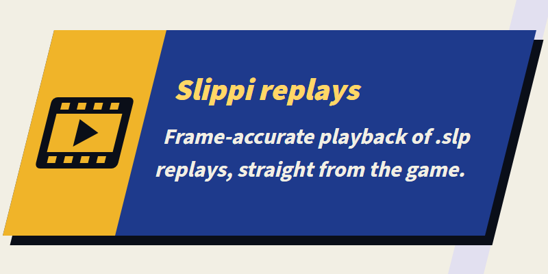
    </picture></td>
    <td><picture>
      <source media="(prefers-color-scheme: dark)" srcset="docs/readme/feature_settings_dark.png">
      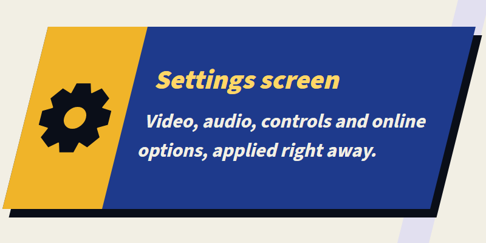
    </picture></td>
  </tr>
  <tr>
    <td><picture>
      <source media="(prefers-color-scheme: dark)" srcset="docs/readme/feature_ucf_dark.png">
      
    </picture></td>
    <td><picture>
      <source media="(prefers-color-scheme: dark)" srcset="docs/readme/feature_determinism_dark.png">
      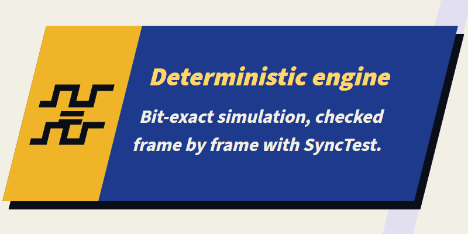
    </picture></td>
  </tr>
  <tr>
    <td><picture>
      <source media="(prefers-color-scheme: dark)" srcset="docs/readme/feature_envoy_dark.png">
      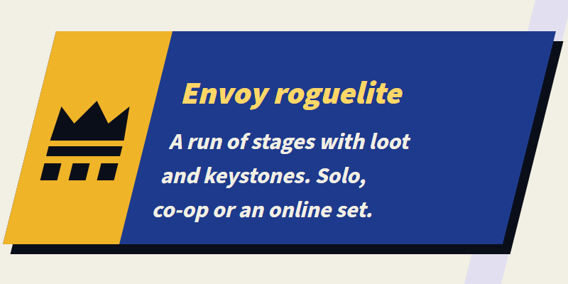
    </picture></td>
    <td><picture>
      <source media="(prefers-color-scheme: dark)" srcset="docs/readme/feature_modbrowser_dark.png">
      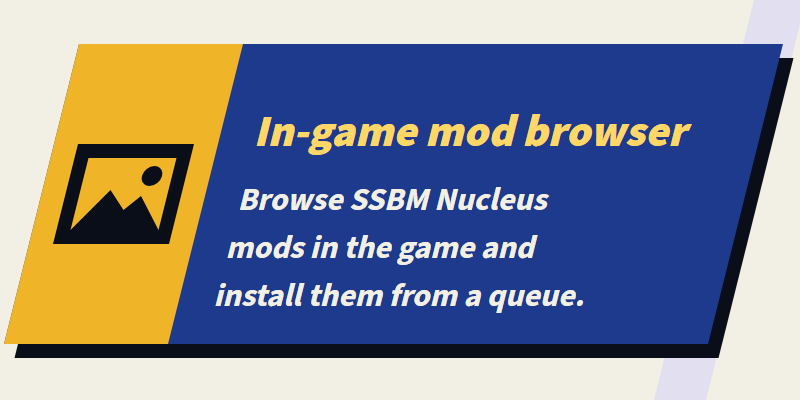
    </picture></td>
  </tr>
</table>

### Features

**Online**
- Rollback netcode, between Windows and Linux players too. Play a friend with a short room code, or
  press **Random Opponent** to be paired with anyone searching.
- A competitive lobby in the same room: blind character picks, stage strikes and bans, ready-up and
  rematches, with the set score kept.
- Stages are split into **starters** (Battlefield, Final Destination, Dream Land, Yoshi's Story,
  Fountain of Dreams) and a **counterpick** (Pokémon Stadium). Game 1 strikes over the starters
  1-2-1; the counterpick opens from game 2 for bans and picks.
- The strike cursor skips struck and banned stages in every direction, with wrap-around.
- Sheik can be picked online (press A on Zelda again), and mods work online: you can pick any
  fighter or stage both players have.
- The GameCube adapter follows the window you're using and is only held in the background during an
  online match.

**Mods (m-ex)**
- Mod discs (ACE, Akaneia) and loose mods copied into the `mods` folder. The launcher's Mods tab
  lists installed mods, enables/disables them, and moves removed mods to a recoverable folder. It does
  not download mods; the in-game browser (above) does,.
- **94 m-ex fighter slots** (up from 31), so big rosters fit.
- The results screen shows m-ex fighters' names, emblems and stock icons.
- m-ex CPUs play from their clone base's CPU tables.

**Menus and screens**
- New main menu, hubs, character select and stage select that list every fighter and stage your
  disc and mods provide, with pages for big rosters.
- **Training can run through the new character and stage select** (`gd.training_select("kit")`,
  or `select=kit` in the scene grammar).
- A **Settings** screen: video, audio, controls, online name and server, mods and gameplay options,
  applied right away and saved.
- Everything unlocked from the start by default, without a save file (Settings > Gameplay turns it off).

**Graphics and input**
- Native rendering (D3D12 on Windows, Vulkan on Linux) at any render scale, vsync off, and an experimental uncapped frame rate.
- About 13 ms from controller to screen, steadily.
- Fullscreen (F11 or Alt+Enter) and 255 costumes per fighter.
- GameCube adapter (plug in any time, clones supported) and any gamepad.

**Scripting**
- Lua scripts and a console (the backtick key). Scripts can read the match, draw, wait on the game,
  add console commands, and, if they declare it, drive gameplay (rollback-safe).
- **`gd.kit`**: scripts draw with the menus' own kit (9-slice panels, the kit's fonts and text
  roles, list rows, icons, the palette) over any scene, a match included. Mods can ship their own
  kit art.
- Built-in examples: `tm_lite` (save/load positions on F5-F8), `state_overlay` (frame data),
  `kit_hud`, `scene_setup`. See [`docs/scripting.md`](docs/scripting.md).

**Launcher and reports**
- English and Spanish; the language follows Windows by default.
- Diagnostics tab, short logs, and local crash reports with your Windows user name removed.
  The Qt launcher opens logs and copies reports for sharing. Uploading crash reports is optional, off by
  default, and only happens when you click "Upload last 3 crash logs".

### Changelog

Per-release notes: [`tools/release/notes/`](tools/release/notes/). Highlights of the 0.1.x line:

- **0.1.5:** the keyboard is hotkeys only (controllers play), a "Connect a controller" notice, the
  mouse in menus (`gd.mouse()` for scripts), items no longer hitch on first spawn, m-ex crash fixes,
  bit-exact matrix maths with six console Slippi replays played back to the bit, and the Geno engine
  and LAB mode.
- **0.1.6:** TRAINING with frame advantage, move data and a configurable dummy; COMBO and DRILLS.

## Screenshots

All captured from the running port (1280x960 window unless noted).

<table>
  <tr>
    <td width="50%">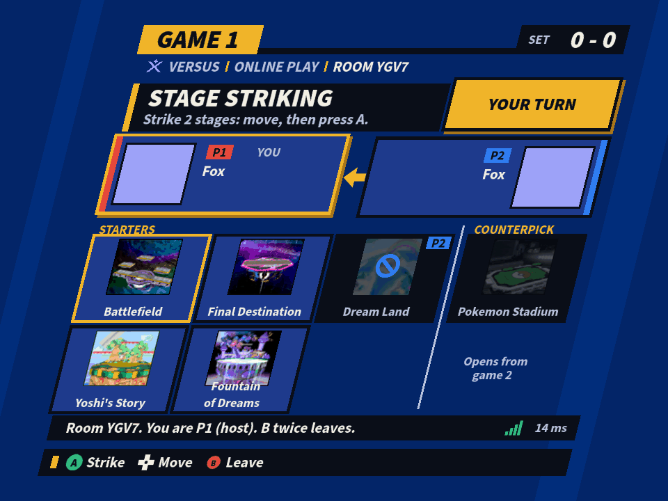</td>
    <td width="50%">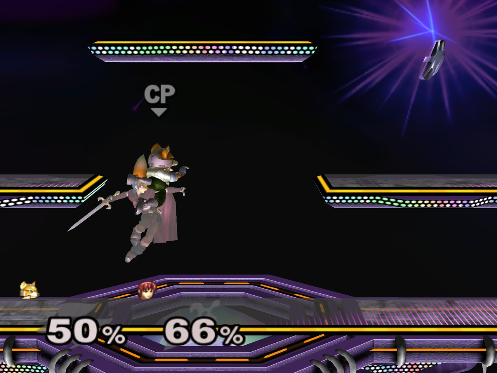</td>
  </tr>
  <tr>
    <td>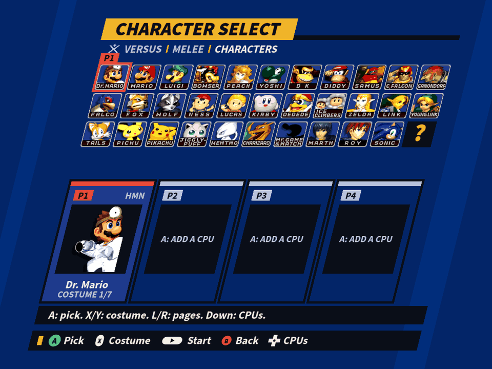</td>
    <td>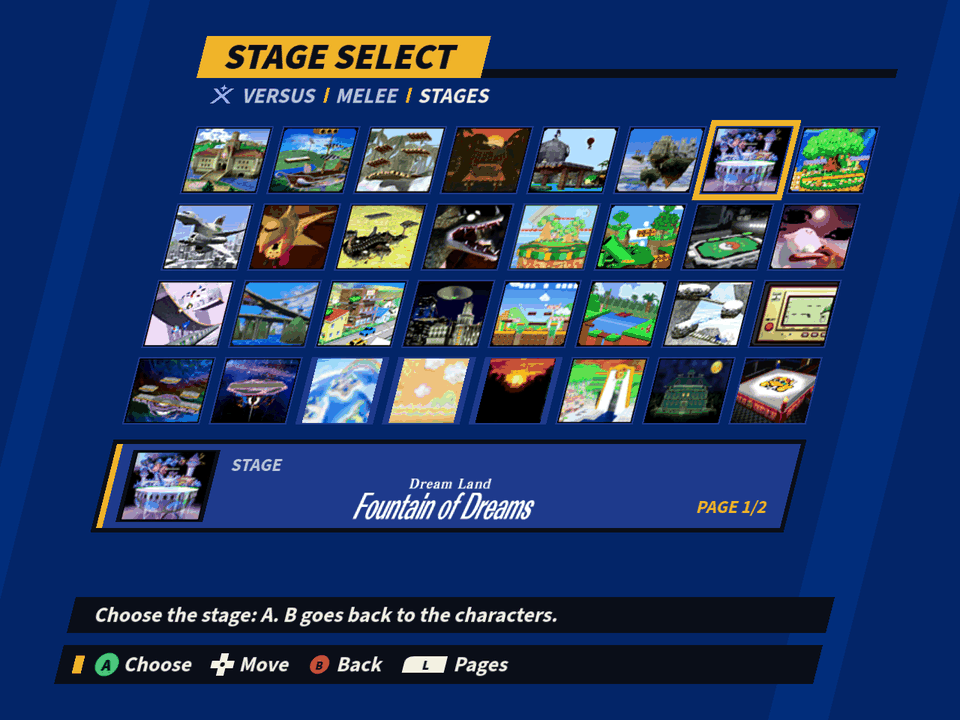</td>
  </tr>
  <tr>
    <td>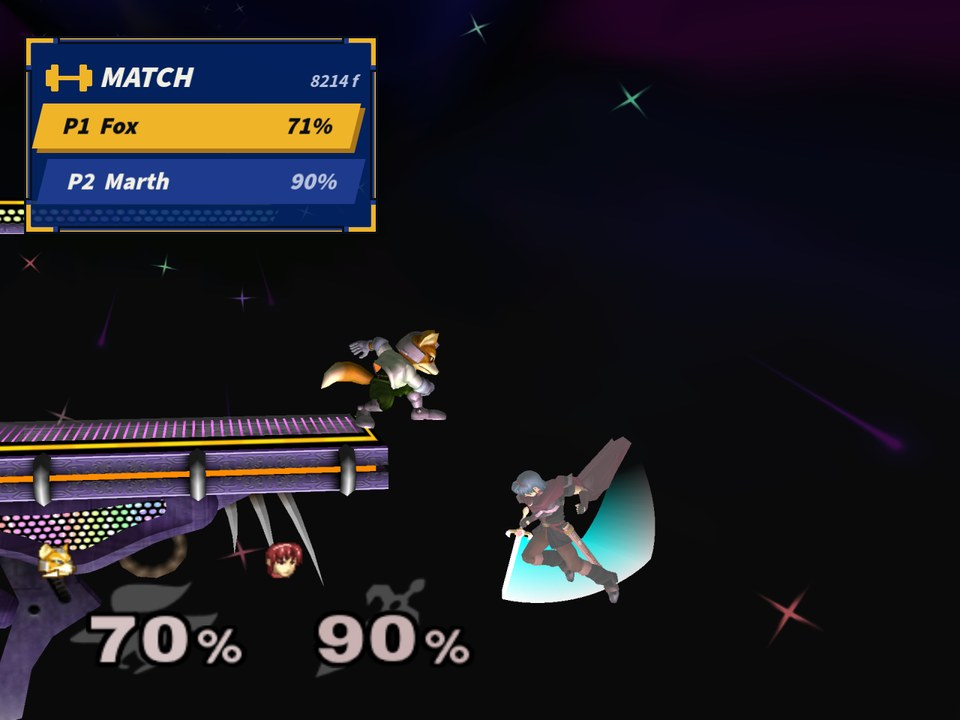</td>
    <td>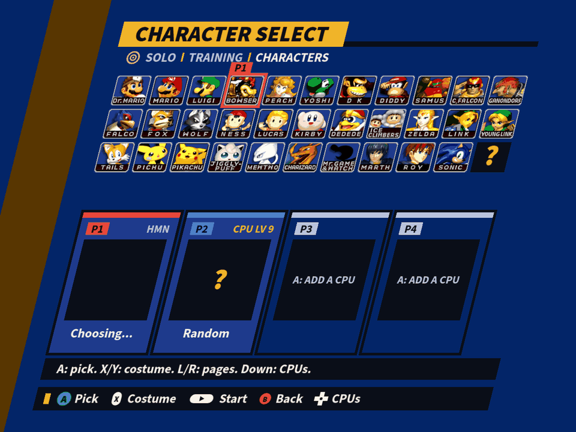</td>
  </tr>
  <tr>
    <td>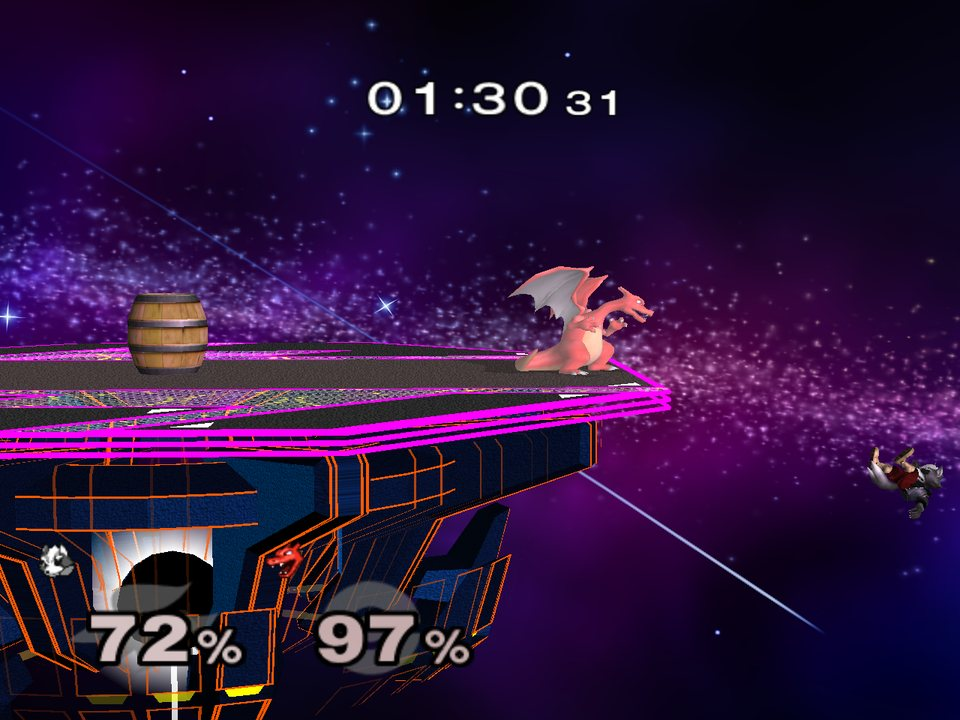</td>
    <td>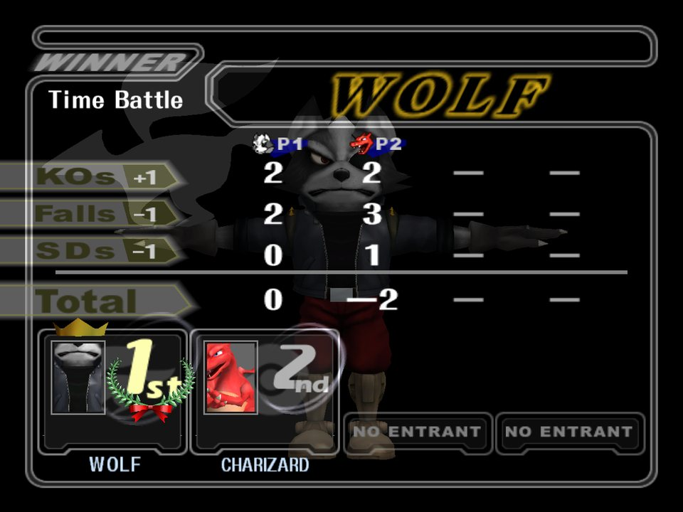</td>
  </tr>
  <tr>
    <td>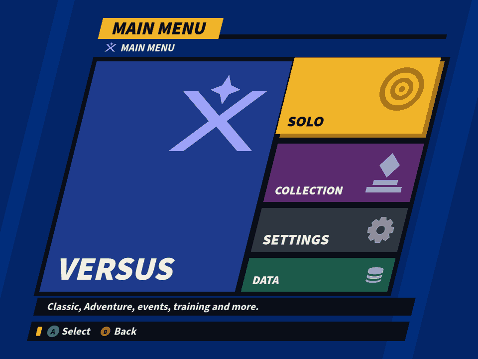</td>
    <td>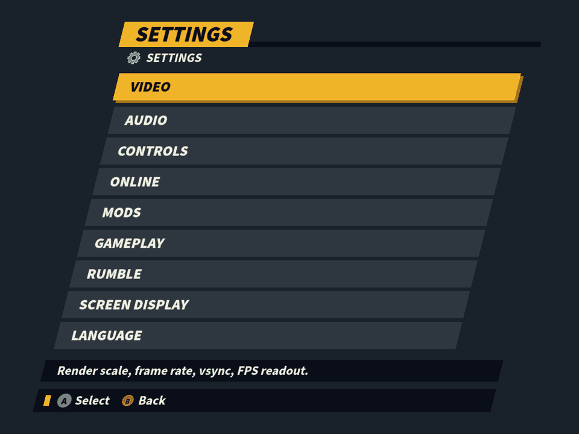</td>
  </tr>
  <tr>
    <td>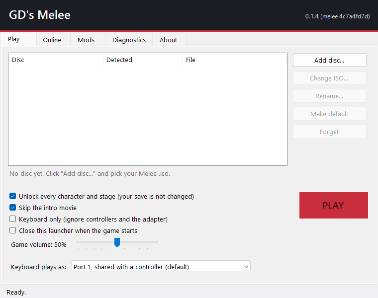</td>
    <td>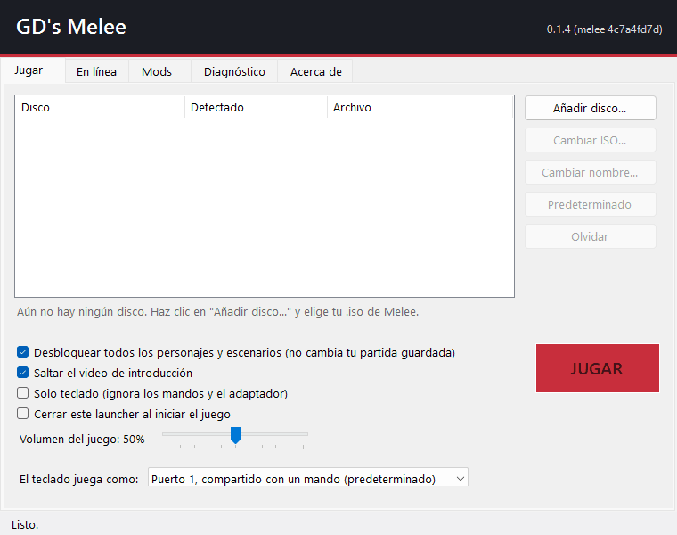</td>
  </tr>
</table>

## The Geno engine

**Geno** is the port's own layer for fighter content that m-ex can't express. A fighter opts in
through a `geno.json` next to its m-ex files; a fighter without one runs exactly as m-ex defines it,
so Geno stays 100% m-ex compatible. Everything it adds lives in the rollback snapshot and is
deterministic, so it works online. Geno adds *character* abilities inside Melee's rules: it never
changes Melee's physics, hitstun, knockback, air dodge or ledge rules.

- **v0, the foundation:** a registry with stable ids (salted into the netplay handshake), a
  per-fighter state block, a script escape in the fighter's own move scripts (variables, if/else,
  calls), attribute overrides, and multi-jump past Melee's table.
- **v1, script features:** script overlays for any subaction, engine values (read, write and
  test), change-action with Brawl-style requirements, rehit, autolink, special-attribute overrides
  and on-land handlers.
- **v2, action states:** brand-new action states with native behaviours: glide, and Brawl-style
  specials such as Mach Tornado and Drill Rush.
- **v3, root motion:** states that follow their animation's root motion on the ground and in the
  air, hidden and intangible values (Dimensional Cape), and Drill Rush rebuilt from Brawl's own code.
- **v4, the model follows the move:** the model pitches with a drill and spins at a tornado's spin
  rate.

The full reference is [`docs/geno.md`](https://github.com/GurekamDhillon/melee/blob/pc-port/docs/geno.md)
in the melee fork.

### LAB, the frame-data lab

**SOLO > LAB** is a game mode of its own for studying any fighter (vanilla, m-ex or Geno): any
fighters and CPUs on any stage, KOs respawn, and the clock never runs out.

- **Display modes** (hitboxes, hurtboxes, ECB, skeleton and more), a HUD drawn in the menus' own
  style, and a full-screen **pause menu** styled after Sakurai's move-list screens.
- **Rewind** a long way back and step frame by frame, a persistent **savestate library**, and **hot
  reload** of a fighter's files mid-match.
- **The state browser:** every action state the fighter has (common, special, m-ex, Geno), played
  from neutral, looped or slowed down, with its script windows beside it.
- **Knockback preview:** where a hitbox will send the victim, with DI, hitstun, tumble and the
  frame it crosses a blast zone, computed by the game's own knockback code.
- **A/B compare:** two fighters, or two versions of one, in lock-step.
- **Frame-data export** and diff.
- **Rollback visualiser:** see what a rollback re-simulates.
- **Vanilla-parity checks** against real Slippi replays recorded on a console: the port plays them
  back and compares every frame.

**New in 0.1.6:** TRAINING shows frame advantage, move data, inputs and technique feedback. A
configurable dummy supports DI, techs, reactions and recorded inputs; COMBO reviews follow-ups,
and DRILLS provides scored practice. LAB remains offline only.

## Ports: Halberd (Meta Knight)

[`ports/halberd/`](ports/halberd/) is **Halberd**, Meta Knight ported from *Super Smash Bros.
Brawl* as an m-ex fighter on Geno: his normals, grabs and throws, his four specials, glide, six
jumps, and his own effects, sounds and menu art. This repository carries the **research only**:
notes, the character IR, the conversion tools and configs. **No Nintendo assets are included**;
rebuilding him requires your own legally obtained copies of the games. The shared character IR
schema is in [`ports/ir/`](ports/ir/).

## Known issues

- UnclePunch's Training Mode features are not fully ported; LAB and `tm_lite` cover different
  practice workflows. TM-CE and 20XX discs boot, but their disc-specific features don't work.
- Fighter and stage mods from different packs (for example ACE fighters with Akaneia stages) can't
  be mixed yet.
- The uncapped frame rate is experimental: the picture trails the game by one frame.
- Teams mode on the new character select isn't finished, and 4-player local matches have had little
  testing.
- Online play has been tested on one PC with two game windows, not yet widely across the internet.
  Online Envoy has only the passive drives.
- New skins appear after a restart. Heavy modded fighters can still cost more than a 120 fps game allows.
- On some Linux laptops the game has run below 60 fps (0.2.1); this is still being worked on.
- On a 144 Hz monitor, 60 fps looks uneven. Set the display to 120 Hz, or turn on G-Sync/FreeSync.

Each release's notes are in [`tools/release/notes/`](tools/release/notes/).

## What this is

Most "Melee on PC" efforts are either emulation (Dolphin + Slippi) or static recompilation of the
retail binary. This project takes a third road — **compiled decompilation**:

- [`doldecomp/melee`](https://github.com/doldecomp/melee) is a matching decompilation of Melee in
  which every game translation unit is real C that reproduces the original PowerPC behavior.
- Those translation units are retargeted to x86 by `pc/tools/gwtool`: clang's PPC front-end emits
  LLVM IR, and gwtool rewrites every memory access to be big-endian, prefixes every symbol with
  `gw_`, and emits x86 COFF. The result links against a native platform layer.
- The GameCube SDK surface (GX, OS, PAD, CARD, AX, DVD, AR, …) is replaced by native shims over
  [Aurora](https://github.com/encounter/aurora) (a GC/Wii SDK reimplementation on top of
  [Dawn](https://dawn.googlesource.com/dawn)), so rendering goes straight to D3D12 (Windows) or Vulkan (Linux) with no emulated
  GPU. Where the SDK's own decompiled source is worth keeping, it is built as a translation unit
  like any other — the THP video decoder is, with its Gekko paired-single IDCT rewritten in
  portable C.
- m-ex content ships PowerPC code inside its data files; the port runs those blobs through a small
  PowerPC interpreter and bridges their calls back to its own native functions.

The payoff over static recompilation is a **fully editable game** — every line of engine code is C
you can change. The price is that all ~980 translation units must be made correct by hand, which is
where most of the engineering goes (see the devlog).

## Status

| Area | State |
|---|---|
| Boot → menus → VS match, Training | working |
| Rendering (GX → D3D12 on Windows, Vulkan on Linux, via Aurora/Dawn), any render scale | working |
| Audio (own AX / DSP-ADPCM mixer over SDL3) | working, incl. both aux buses + AXFX reverb/delay |
| Cutscenes (THP video, own decoder) | working |
| Memory-card saves (GCI) | working |
| GameCube adapter, gamepads (keyboard = hotkeys only), mouse in menus | working |
| Vanilla parity (console Slippi replays, bit-exact) | working |
| Geno engine + LAB mode | public test, including LAB training, dummy, combos and drills |
| Frame pacing | hard 60 Hz; experimental uncapped frame rate |
| Rollback netplay + competitive lobby | public test |
| Slippi replay playback | working |
| m-ex discs and loose mods (94 fighter slots) | public test |
| Lua scripting + console | working (API 1) |
| Windows x64 and Linux x86_64 builds, Windows-vs-Linux online play | public test (0.2.2) |
| Launcher (Qt, English and Spanish), release packaging | public test (0.2.2) |
| In-game SSBM Nucleus mod browser (zip mods) | public test (0.2.2) |
| Envoy roguelite (solo, offline co-op, online sets with passive drives) | public test; look and balance still being tuned |
| Widescreen | Hor+ gameplay; centred wide kit menus and Lua canvas, live VIDEO toggle (menu changes awaiting in-game verification) |

## Repository layout

```
docs/DEVLOG.md        engineering log: every hard-won fact, bug and fix (read this first)
docs/HANDOFF.md       current state + next experiment (resume here)
docs/scripting.md     the Lua scripting API, the console and the examples
PORT_BOOTSTRAP.md     project origin and the feasibility analysis
_research/            boot gates, SDK/console invariants, shim surface, port dev quickref
_build/               Windows build scripts (Aurora, per-TU pipeline, link, run)
tools/port/           build.sh (build + bridge fixpoint), run.sh (sandboxed runs)
tools/release/        the launcher, release build/check/publish scripts, release notes
tools/netplay/        the matchmaking server and netplay test drivers
ports/               fighter ports (research only, no assets): halberd/ (Meta Knight), ir/ (character IR)
DEPENDENCIES.md       every third-party component, its version/pin, and its licence
```

The port source itself lives in the `melee` fork of `doldecomp/melee`, on the
[`pc-port`](https://github.com/GurekamDhillon/melee/tree/pc-port) branch, under `pc/`
(`pc/platform` shims, `pc/gameworld`, `pc/tools/gwtool`). That fork is the buildable project; this
repository carries the tooling, launcher, research and engineering log around it.

## Building

Host is Windows with WSL, MSVC Build Tools, clang 23, and CMake/Ninja for Aurora. The exact,
maintained commands are in [`_research/port-dev-quickref.md`](_research/port-dev-quickref.md). In
short:

1. Build Aurora + Dawn + SDL3 — `_build/build_aurora_melee.bat`.
2. Build `melee-pc.exe` — `tools/port/build.sh` compiles changed translation units through the
   retarget pipeline, links, and regenerates the m-ex bridge until it is a fixpoint.
3. Run it against your own disc image — `tools/port/run.sh <name> --iso <path to GALE01 v1.02>`.
4. Package a release — see [`tools/release/README.md`](tools/release/README.md).

## Legal

- **No copyrighted material is included.** You must supply your own legally dumped ISO of
  *Super Smash Bros. Melee* (NTSC 1.02). No ROM, no game assets and no Nintendo SDK code are
  distributed here. The screenshots show the port running on the author's own discs.
- **Ports carry research only.** `ports/` holds notes, tools and configs, never game files; a port
  such as Halberd is built locally from your own legally obtained copy of the source game
  (*Super Smash Bros. Brawl*), and `.gitignore` keeps every built asset out of the repository.
- Not affiliated with, endorsed by or sponsored by Nintendo. *Super Smash Bros.* and *Melee* are
  trademarks of Nintendo.
- The underlying decompilation is a pre-existing, openly published, research-oriented effort.
- The port is licensed **GPL-2.0-or-later** — see [`LICENSE`](LICENSE).

## Credits

- [doldecomp/melee](https://github.com/doldecomp/melee) — the decompilation this is built on.
- [encounter/aurora](https://github.com/encounter/aurora) — GC/Wii SDK reimplementation.
- [google/dawn](https://dawn.googlesource.com/dawn) — WebGPU implementation.
- [TwilitRealm/dusklight](https://github.com/TwilitRealm/dusklight) — precedent for turning a
  GameCube decomp into a native cross-platform port.
- [akaneia/m-ex](https://github.com/akaneia/m-ex) and its contributors — the content-expansion
  framework whose patches are used as the **specification** for behaviors reimplemented in the
  port (no m-ex source is vendored or built; see
  [`DEPENDENCIES.md`](DEPENDENCIES.md#specification-references-not-built)).
- Dolphin Emulator — `pc/gameworld/gekko_fp.c` derives from `Common/FloatUtils.cpp`
  (GPL-2.0-or-later); attribution is in that file.
