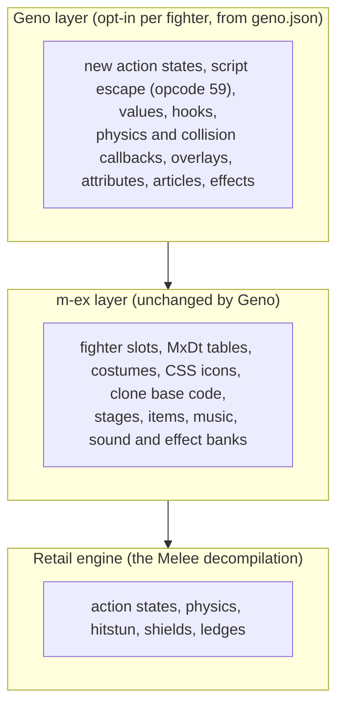

# Packet 0: What m-ex and Geno are

**Goal:** understand how m-ex and Geno fit together, so you know what each gives you and what you
can and cannot make today.

**You will have at the end:** a one-page mental map, and the answer to the question this course
starts from: "Is Geno able to do everything m-ex does, or do we not do anything that m-ex already
covers?"

**Prerequisites:** none. Time: about 30 minutes. This packet is reading only.

**Status (2026-10-03):** reading only, nothing in it is a step to run. A tester followed it as a
newcomer alongside packets 1 to 3 and found no claim here that the game contradicts. Of the
`geno.json` keys in the table below, only `attributes`, `jumps`, `subactions`, `states` and
`specials` were exercised (packets 1 and 3); the rest were not run.

## The answer

**Geno does not re-implement what m-ex covers, and it is not a replacement for it.** m-ex answers
"how does a fighter exist in the game". Geno answers "how does this fighter play, beyond what its
clone base does". Geno layers on top of the m-ex layer and never edits it. A fighter without a
`geno.json` runs exactly as m-ex (or the retail game) defines it. So the two are used together, and
today a brand-new fighter on a disc still gets its place in the game from m-ex.

The same picture as the reference draws it is in `melee/docs/geno.md` section 2. Geno's per-frame
dispatch points run after m-ex's: for example Geno's `on_frame` hook runs after m-ex's own onFrame
(section 2).

## What m-ex is, in this port

m-ex is a community framework. A mod disc such as ACE or Akaneia carries its content as data in a
table archive called `MxDt.dat`, plus ordinary disc files. The port does not patch the game's
PowerPC program. It reimplements m-ex's behaviour in C, reads `MxDt.dat`, and still interprets the
small pieces of PowerPC code that m-ex fighters carry inside their own data files (`docs/mods-packaging.md`
sections 1 and 2.3; see packet 10 for a wording problem about this).

How an added fighter exists at all (`docs/mods-packaging.md` sections 2.3 and 2.4):

1. **A slot.** The port walks the fighter rows in `MxDt.dat` and gives a slot to every row whose
   fighter file exists on the disc or in a mounted mod. Slots are dense: no holes, so a fighter's
   number depends on which fighters are present. There are 94 slots (README, "Mods (m-ex)").
2. **Data files.** The fighter's main file (`Pl<xx>.dat`, with attributes, subactions and scripts)
   and its animation file (`Pl<xx>AJ.dat`), one file per costume, a results-screen file, sound and
   effect banks.
3. **Table rows.** About 33 parallel arrays in `MxDt.dat` hold the fighter's names, file names,
   costume counts, sound bank, announcer call and so on.
4. **Costumes and icon.** Costume files, and a character-select icon in the menu archive.
5. **A clone base.** Each row can give the fighter's own callbacks (its move code). Where it gives
   none, the engine falls back to the **clone base**, an existing fighter, so the new fighter's
   moves run as that fighter's do (`docs/mods-packaging.md` section 2.3, the `fighter_function`
   row; `_research/vanilla-single-folder-mods-2026-10-03.md` section 1.3).

## What Geno is, in this port

Geno is native code and data in `melee/pc/geno/` and `melee/pc/platform/geno_registry.c`. It is
**opt-in per fighter**: only a `geno.json` in a mounted mod activates anything, and with none
anywhere Geno is inert (`melee/docs/geno.md` section 3, points 1 and 2). The file sits beside
`mod.json` in the mod's folder (section 7).

Geno's scope rule: it adds **character-level** abilities inside Melee's rules. It does not change
Melee's hitstun, knockback, air dodge, ledge rules or tripping. A fighter you make with Geno plays by
Melee's physics, and only what belongs to that fighter changes (section 1).

Online, Geno stays safe because all its state is game state that savestates and rollback cover
(section 4), and a fighter's Geno profile id is mixed into its netplay identity (section 3, point 5).

## What each gives you

The table lists what a fighter author gets from each layer. Section numbers are in
`melee/docs/geno.md` unless the source is named.

| you want | from m-ex | from Geno |
|---|---|---|
| A new fighter slot and a file for its data | yes (`docs/mods-packaging.md` 2.4) | no: Geno `define` is reserved and skipped (7, 13) |
| Table rows: names, file names, costume count, sound bank | yes (`MxDt.dat`) | no |
| Costumes, character-select icon, stock icons | yes | no |
| The clone base's moves | yes (fallback to the base's callbacks) | uses them, then changes them |
| Stages, items (custom kinds), music, sound banks | yes | no |
| A way to ship fighter code | m-ex fighter callbacks (PowerPC, interpreted) | native behaviours, scripts and data instead (no PowerPC authoring) |
| **New action states** beyond the clone base's | no | yes: `states` (16.1), rows from motion id 0x400 |
| **Script logic** in move scripts: variables, if/else | no | yes: the escape, opcode 59 (8, 15.1) |
| **Engine values** read and written from scripts (facing, velocity, stick, jumps...) | no | yes: GET, PUT, IFV (15.2, 17.2) |
| **Change-action conditions** (Brawl-style "go to X when Y") | no | yes: CHG, CHGAND, CHGCLR (15.3) |
| **Hooks** and dispatch points | m-ex has its own hook tables | yes: native hooks bound to `on_init`, `on_frame`, `on_action`, `on_land`, `on_hit` (9, 15.5, 19.3) |
| **Physics and collision callbacks** for a state | clone base's | yes: named behaviours and callbacks (16.2, 17.1, 17.3) |
| **Sub-action overlays**: replace a move's script | edit the file | yes: `subactions` (15.5) |
| **Attribute overrides** (gravity, walk speed...) | edit the file | yes: `attributes` (7); 40 fields |
| **Special-attribute overrides** | edit the file | yes: `special_attributes` (15.5) |
| **Multi-jump** past Melee's table | no | yes: `jumps` (10) |
| **Rehit, autolink, hitbox damage, extra hitstun, contact flags** | no | yes: REHIT, LINK, HBDMG, HBSTUN, HBFLAGS (15.4, 19.12) |
| **Articles** (projectiles) | m-ex custom items | yes: `articles` (19) |
| **Effects** | m-ex effect banks | yes: `.gfx.json` packages and bindings (19.11, 20) |
| **Motion-to-animation remaps** | no | yes: `motion_anims` (19.12) |
| **Counter windows** | no | yes (19.4) |
| **Root-motion states, hidden state, ledge control** | no | yes (17) |
| **Standalone native items** | custom items need `MxDt.dat` | yes, added 2026-10-03 (19.13) |
| A view of what you built | no | the LAB (14), which also studies plain and m-ex fighters |

Standalone Geno items are being extended today and are not yet documented here. Treat 19.13 as
source that has not run in the game.

## What neither does today

Be honest with yourself before you plan a fighter.

- **A fighter that lives in one folder and runs on a vanilla disc.** A new fighter today is an m-ex
  slot row, and the working examples carry copies of the table files from a mod disc inside their
  mod folder. Those copies are disc-derived, so they cannot be shared. A design to fix this exists
  and is unbuilt: `_research/vanilla-single-folder-mods-2026-10-03.md`. Overlays that attach to an
  existing fighter need no m-ex tables and have been run on a vanilla disc (that note, section 1.5).
- **`define`**, a Geno-native brand-new fighter, is reserved and skipped (`melee/docs/geno.md`
  sections 7 and 13).
- **Brawl or Ultimate global mechanics.** Not added by design (section 1).
- **A model and animations from nothing.** Geno does not make art. A new look needs the port's model
  and animation pipelines (packet 6, packet 9).
- **Heads-up display elements** are a design, not built (11b).
- **Sound.** Geno has no sound system of its own. Scripts use Melee's sound command and sound banks
  come from m-ex (`docs/mods-packaging.md` 2.3).
- **Mixing packs.** Entity mods combine only within one pack (`docs/mods-packaging.md` section 8).

## What you can make today, in plain terms

| a fighter you might want | possible? |
|---|---|
| Tune an existing fighter's numbers | yes, an overlay with `attributes` (packet 1) |
| Change or add a move on an existing fighter | yes, overlays and Geno states (packet 3) |
| A fighter with its own model and slot | yes, as an m-ex slot plus Geno, built by the pipeline in `ports/` (packets 2, 6, 9). It needs a mod disc's tables today |
| A fighter from nothing but a folder, on a vanilla disc | not yet |

## Check yourself

- Can you say in one sentence what m-ex provides and what Geno provides?
- Why does a fighter without `geno.json` stay exactly as before?
- Name two things the table says only Geno can do, and two it says only m-ex can do.
- Which kind of Geno profile exists today, `attach` or `define`?

## Common mistakes

- Thinking Geno needs the m-ex layer to run. An overlay on a retail fighter does not need
  `MxDt.dat`. Attaching to an m-ex fighter by its file name does need that fighter's slot to exist.
- Thinking Geno changes the whole game. It never does. An overlay changes one fighter.
- Treating the old reference intro as current. `melee/docs/geno.md` section 1 names Brawl Kirby as a
  first customer; the fighters in the tree today are Halberd, Ultimate Kirby and Sora
  (`ports/README.md`).

## Sources

- `melee/docs/geno.md` sections 1 to 4, 7 to 10, 13 to 20 (the table rows carry their own section numbers).
- `docs/mods-packaging.md` sections 1, 2.3, 2.4, 8.
- `docs/MEX_PORT_STATUS.md` (implemented surfaces; Geno is "an extension alongside m-ex").
- `_research/vanilla-single-folder-mods-2026-10-03.md` sections 0, 1.2 to 1.5.
- `melee/pc/geno/CLAUDE.md` (contracts: opt-in, m-ex untouched).
- `README.md`, "The Geno engine".
- `ports/README.md`.
