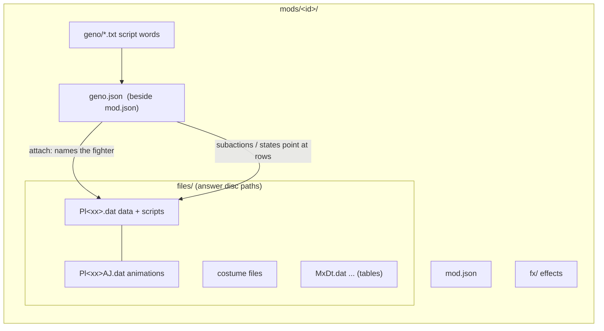
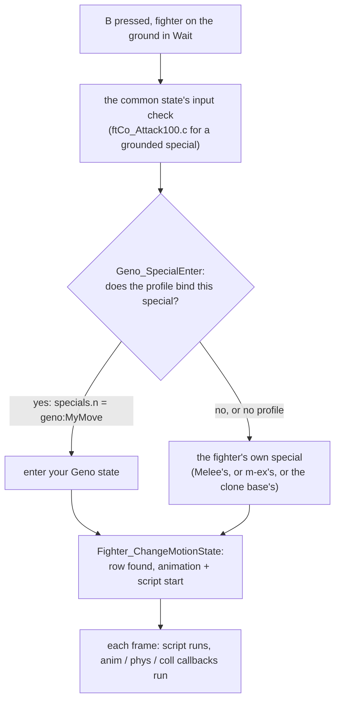

# Packet 2: Anatomy of a fighter

**Goal:** know what a fighter is made of in this port, where `geno.json` sits among its files, and
how a button press becomes a move.

**You will have at the end:** a filled-in map of one fighter's action states and the subaction
(animation and script) each one plays, read from the LAB, plus a clear idea of which of the fighter's
pieces Geno can change.

**Prerequisites:** packets 0 and 1 (the LAB running, your `tutorial-kirby` mod). Time: about 45 minutes.

**Status (2026-10-03):** Part 4 was run in the game through the console: `gd.motion_list(1)`,
`lab moves`, `lab play`, `lab events`, and the state numbers below were checked on a Kirby. The
`6`, `V`, `T`, `F3` keys were not pressed by a person (the console forms replace them). Parts 1 to 3
are reading and were not contradicted, except for the Kirby list end below. Overlays and states
you add in packet 3 show up in this list too, so do Part 4 before packet 3.

## Part 1: the files

A fighter is mostly data. These are the pieces, using Meta Knight's research configuration as the
example of a complete added fighter (`ports/halberd/mods-slot/metaknight-slot/`):

```
mods/metaknight-slot/            the mod folder; its name is the mod id
  mod.json                       who it is, what it requires
  geno.json                      Geno: how this fighter plays (not a disc file)
  geno/                          word files for script overlays (not disc files)
  files/                         everything in here answers a disc path
    PlBm.dat                     fighter data: attributes, subactions (scripts), articles, m-ex code
    PlBmAJ.dat                   the animations
    PlBmNr.dat  PlBmBu.dat ...   one file per costume (colour suffix)
    EfBmData.dat                 an effect bank
    audio/us/...                 a sound bank
    MxDt.dat  PlCo.dat           shared tables (see below)
    MnSlChr.usd  IfAll.usd       character-select and in-match HUD art archives
    GmRst.usd ...                results screen
```

(The `files/` folder of that research configuration is build output made on the author's machine
from a disc, and is not committed. The listing shows what a complete added fighter contains.)

What the engine does with a mod folder (`docs/mods-packaging.md` section 2.1): every file under
`files/` answers the disc path of its position, so `files/PlBm.dat` is the file `/PlBm.dat`. A path
the disc already has is replaced in place; a path it lacks is added. `geno.json`, `scripts/*.lua`,
`fx/` and `ui/` are not disc files: they are read by name from the mod folder.



### The three kinds of mod

| kind | what is in `files/` | example in the tree | needs a disc's tables |
|---|---|---|---|
| **Overlay** | nothing, or nothing needed | your `tutorial-kirby`; the Ultimate Kirby movement pack (`ports/kirby-ultimate/README.md`) | no |
| **Added fighter (m-ex slot)** | its own `Pl` files, costumes, art, and a copy of the table files | Meta Knight (Halberd), Sora | yes, today |
| **Geno-native fighter (`define`)** | not built | none | not applicable |

An overlay changes an existing fighter. An added fighter gets a new slot from an m-ex row, and
Geno's `attach` then points at it by its data file name (`"attach": "PlBm.dat"` in Meta Knight's
`geno.json`; `melee/docs/geno.md` section 7). For why added fighters carry table copies today and
what is planned, read `_research/vanilla-single-folder-mods-2026-10-03.md` section 0.

### The clone base

An m-ex fighter row can leave its function table empty. The engine then runs the **clone base**: an
existing fighter whose callbacks fill every gap. Meta Knight's row clones Kirby. So Meta Knight's
walk, jump and any special he has not replaced run Kirby's code, while his data file supplies his
own numbers, model and animations (`ports/halberd/mods-slot/metaknight-slot/mod.json`: "a Kirby
clone"). Geno then adds what Kirby's code cannot do, such as states beyond Kirby's.

## Part 2: action states

An **action state** is one thing the fighter can be doing. The engine numbers them (the reference
says "motion id"):

| range | what |
|---|---|
| 0 to 340 | common states: Wait, walk, jump, shield, attacks, damage... |
| 341 and up | the fighter's own specials. Each retail fighter's table is its own; Kirby's is the longest (his last special state in the LAB's list is 543, `0x21F`) |
| past that, for an m-ex fighter | the m-ex move-logic table |
| `0x400 + n` | **Geno states**: state `n` of your profile's `states` list |

(`melee/docs/geno.md` sections 15.3, 16.1 and 14.11.) Each state has a row, a `MotionState`
(`melee/src/melee/ft/types.h`): which subaction it plays, flags (for example the move id used for
staling), and functions the engine calls each frame:

| callback | what it does each frame |
|---|---|
| anim | what happens when the animation ends or progresses |
| iasa (interrupt) | what inputs may cancel the state and where they lead |
| phys | movement: gravity, drift, friction |
| coll | collision with the stage: landing, ledges, walls |

(Geno's named behaviours bundle these four, section 16.2.)

A **subaction** is the pair the state plays: an animation from the `AJ` file, and a script from
the fighter's data file. The LAB shows the subaction number as `anim_id`, and Geno's `states`
rows set the row's `anim_id` from the `subaction` you give (`melee/pc/geno/geno_game_v2.inc`, where
`row->anim_id = anim`). So the numbers are the same thing.

The **script** is the list of commands that makes the move happen on the right frames: a hitbox
opens at frame 5, closes at frame 9, a sound plays, the move becomes cancellable. Packet 3 writes one.

## Part 3: how a button press becomes a move

Take the neutral special, B. The path, from the code:



The eight special inputs (neutral, side, up, down, each on the ground and in the air) ask Geno first.
Everything else (jab, tilts, aerials, jumping) is the common code, which you change through scripts
and change-action checks. Three ways a button reaches your state (`melee/docs/geno.md`):

1. **Bind a special.** `"specials": {"n": "geno:MyMove"}` (section 16.1). The simplest.
2. **A change-action check in a script.** `CHG` with a condition such as "button pressed" and a
   target `GENO(n)` (section 15.3). Works from any state whose script you control.
3. **A dispatch point.** A hook on `on_frame` or `on_land` (section 9) that reads values and acts.

Each frame, in order (section 15.7): Geno's pre-animation step (counts action frames, REHIT timers,
and runs the registered change-action checks), the state's callbacks, the collision callback, and
later Geno's `on_frame` after m-ex's own.

## Part 4: Do it. Map one fighter in the LAB

1. Start the LAB with your `tutorial-kirby` mod, Kirby as player 1.
2. Press `6` for MOVES. Press `V` to cycle the filter: ALL, ATTACKS, COMMON, SPECIAL, M-EX, GENO
   (section 14.11).
3. For five states, write down the **name**, the **group** (common or special), and the **anim_id**.
   Include Wait, Attack11, AttackAirN, one special and one more of your choice. The console shows
   the whole list as data: `= gd.motion_list(1)` returns, per state, `{id, name, group, anim_id,
   anim_name}` (section 14.11, `gw_script.c` `gd.motion_list`). The list is long (about 550 states
   for Kirby). To print only the rows you want, filter it:

   ```
   = (function() local o={} for _,m in ipairs(gd.motion_list(1)) do if m.name=="Attack11" or m.name=="AttackAirN" or m.name=="Wait" then o[#o+1]=m.id.." "..m.name.." "..m.group.." "..tostring(m.anim_id) end end return table.concat(o," | ") end)()
   ```

   `lab moves Attack11` prints one state's row, `lab moves` with no text lists all of them.
4. Pick one state, play it with Enter, press `T`, and note when its first hitbox opens and closes.
   (Console: `lab play Attack11`, then `lab events`; the `fN` at the start of a line is the frame.
   For the jab the hitbox is on from f4 to f6.)
5. Press `F3` for the help panel. It lists this mode's keys.

Your map, filled in:

| state name | motion id | group | anim_id | first hitbox frame |
|---|---|---|---|---|
| Wait | | common | | none |
| Attack11 | | common | | |
| AttackAirN | | common | | |
| | | special | | |
| | | | | |

Two states may share an `anim_id`. If they do, a change to that subaction's script changes both.
Packet 3 depends on this. On a real Kirby, for example, the two capture states (`SpecialNCapture0`
and `SpecialNCapture1`) play the same row, while the air neutral special (`SpecialAirN`) plays a
different row from the ground one (`SpecialN`).

## Check yourself

- Which file holds a move's script, and which holds its animation?
- Where does `geno.json` sit in the folder, and is it a disc file?
- What is a clone base, and what happens to a special that the fighter's row does not replace?
- What number does the LAB call `anim_id` and `geno.json` call `subaction`?
- Which inputs ask Geno before the fighter's own code?

## Common mistakes

- Treating `states` indices as motion ids. State `n` is motion `0x400 + n`; in scripts you use `n`.
- Believing a new subaction number appears by writing it in `geno.json`. A state can only point at
  a subaction row the fighter's data file already has (`melee/docs/geno.md` section 12). New rows
  and animations come from the port pipeline (packet 6 and 9).
- Putting `geno.json` inside `files/`. It sits beside `mod.json`.

## Sources

- `docs/mods-packaging.md` sections 2.1, 2.3, 4.
- `melee/docs/geno.md` sections 7, 9, 12, 14.3, 14.11, 15.3, 15.7, 16.1, 16.2.
- `melee/pc/geno/geno_game_v2.inc` (`Geno_SpecialEnter`, the row's `anim_id`).
- `melee/src/melee/ft/kinds/ftCommon/ftCo_Attack100.c` (the ground special site).
- `melee/src/melee/ft/types.h` (`MotionState`).
- `ports/halberd/mods-slot/metaknight-slot/mod.json` and `geno.json`.
- `_research/vanilla-single-folder-mods-2026-10-03.md` sections 0 and 1.3.
