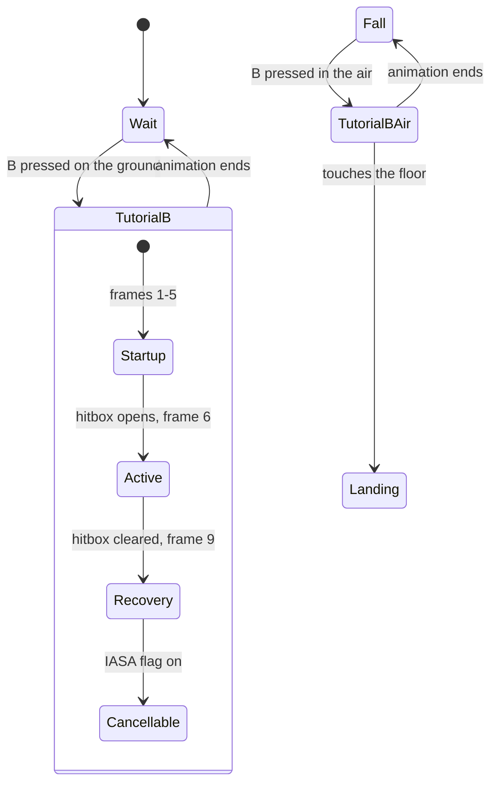

# Packet 3: Your first new move

**Goal:** give Kirby a new neutral special of your own: a Geno action state with a script you wrote
(a hitbox and a cancel window), bound to the B button, and test it frame by frame in the LAB.

**You will have at the end:** a move that did not exist before, a script file you can read, and
the numbers in it checked against the LAB's own decoding.

**Prerequisites:** packets 1 and 2 (your `tutorial-kirby` mod works, and you filled in the state
map). Python 3 for `hitbox_words.py`, which sits beside this packet. Time: about 90 minutes.

**Status:** run in the game by a tester on 2026-10-03 (a source build, the vanilla disc, driven
through the console and scripted pad input). The recipe works end to end: B starts the move, the
hitbox hits for the stated damage, a changed damage word applies on reload, and Kirby's other
specials still work. Three things in the first draft were wrong and are corrected below: the jab's
bone is not 2, the move was not cancellable until the state asks for `"iasa": "interrupt"`, and the
LAB's timeline, `lab events` and `lab card` cannot show an overlay script (they show 0 events). Not
checked by a person at the screen: the key presses (`6`, `V`, `D`, `3`, `T`, `F8`), the look of the
timeline and hitbox display, and Kirby's copy abilities. Packet 10 lists what is still open.

## Read this first: what "a new move" means here

A Geno state needs an animation and a script, and both come from a **subaction row** the fighter's
data file already has (packet 2). Geno cannot add animation rows by itself. So this packet makes a
new *behaviour* on an existing animation:

1. Pick a subaction row the fighter's input no longer needs. Kirby's own neutral special will be
   unreachable once B is bound to your state, so its row is free.
2. **Replace that row's script** with your own, using a `subactions` overlay. The overlay replaces
   the script of that row everywhere it is used (`melee/docs/geno.md` section 15.5).
3. Add a **Geno state** that plays that row, and bind B to it with `specials` (section 16.1).

The result changes Kirby on your install: his B becomes your move, and his inhale is gone until you
remove the mod. A truly new animation needs the port's animation pipeline (packet 6 and 9).



## Step 1: choose the row and the numbers you need

In the LAB, with your mod loaded and Kirby as player 1:

1. Press `6` (MOVES) and press `V` until the filter says SPECIAL. Find the state named
   `SpecialN` (Kirby's grounded neutral special start). Write down its **anim_id**. Call it
   `ANIM_ID` below. (Console: `lab moves SpecialN` prints the motion id; the anim_id is in
   `= gd.motion_list(1)`, packet 2. Do this before you add any state of your own.)
2. Check that no other state uses it. Scan the MOVES list for the same anim_id, or ask the console:

   ```
   = (function() local s = "" for _, m in ipairs(gd.motion_list(1)) do if m.anim_id == 123 then s = s .. m.name .. " " end end return s end)()
   ```

   Replace `123` with your `ANIM_ID`. The names printed are the states that play that row. On the
   tester's Kirby it printed only `SpecialN`, so the row was free. If more than one state appears,
   your script will run in all of them. Choose another row, or accept that, and note it. (Once your
   states exist the same line also lists them, since they play the same row.) Kirby's air neutral
   special, `SpecialAirN`, plays a different row; this packet uses the ground row for both of your
   states on purpose.
3. Write down the motion ids of **Attack11** and **AttackAirN** from your packet 2 map. Call them
   `JAB_ID` and `NAIR_ID`. Your two states borrow these states' flags (the `like` key). (They are the
   decompilation's common motion numbers, 44 and 65 on the tester's build.)
4. Find a **bone**. Press `2` (HITBOXES), press Space to pause, and play Attack11 from MOVES. When
   the jab's hitbox is out, the data panel (`D`) shows its fields, including `bone`. That joint is
   the fist. Call it `JOINT`. (`gd.hitboxes(1)` returns the same, section 14.3; so does
   `lab play Attack11` then `lab events`, which prints `hitbox #0 b<JOINT> ...`, packet 1 step 7.)
   Do not use the number 2 from the example below: the jab's bone on the tester's build was
   a different, much higher number.

## Step 2: write the script, with a tool for the hard part

A script is a list of 32-bit words, one command after another (`melee/docs/geno.md` section 8 and
the decoder names in `gw_script.c`). The four commands you need:

| command | word | meaning |
|---|---|---|
| wait N frames | `0x04000000 + N` (opcode 1 in the top six bits) | pause the script N frames |
| hitbox | 5 words (opcode 11) | open a hitbox |
| clear hitboxes | `0x40000000` (opcode 16) | close every hitbox |
| IASA | `0x5C000000` (opcode 23) | the move may now be cancelled |

The script ends by itself: the engine appends an End to an overlay (`melee/pc/geno/geno_tests.c`,
test `test_geno_v1_overlay`).

The hitbox command is the awkward one, because its five words pack a dozen numbers. Use the helper
that sits beside this packet:

```
python hitbox_words.py --joint JOINT --damage 8 --size 4 --z 10 --decode
```

With `--joint 2` it prints, for example:

```
# hitbox: slot 0 joint 2 damage 8 size 4 angle 361 kbg 100 wbk 0 bkb 30
0x2C001008 0x04000000 0x00000A00 0xB4990000 0x0F000087
```

and `--decode` reads the fields back from the words so you can see they are what you meant. Use
your own `JOINT`. (The words were checked in the game: damage, size, angle, growth and base knockback
read back through `gd.hitboxes(1)` exactly as encoded.) Hitbox fields, in plain words:

| field | meaning |
|---|---|
| `damage` | whole percent. Melee stores whole numbers |
| `size` | radius of the hitbox sphere |
| `x y z` | offset from the bone, in the bone's own axes, in the order x, y, z (the LAB reports them as `ox`, `oy`, `oz`). The bone is turned, so +x is not "forward": in the tester's test +10 on one axis moved the hitbox by about 8 units, but in a direction that depended on the axis and the pose. Use `gd.hitboxes(1)` (its `x`, `y`, `z`) to see where a try landed |
| `angle` | launch direction in degrees. 361 is Melee's "Sakurai angle" |
| `kbg` | knockback growth: how much more it launches as damage rises |
| `bkb` | base knockback: launch even at 0% |
| `wbk` (`--fkb`) | weight-based (fixed) knockback. Leave 0 for normal knockback |
| `element` | 0 normal, 1 fire, 2 electric, 3 slash, 5 ice |

Now create the word file `geno/tutorial_b.txt` in your mod folder. Whitespace separates words, `#`
starts a comment (section 15.5):

```
# TutorialB: wait 5 frames, open one hitbox, hold it 3 frames, clear it,
# wait 6 more frames, then allow cancelling.
0x04000005
0x2C001008 0x04000000 0x00000A00 0xB4990000 0x0F000087   # hitbox: use YOUR joint words here
0x04000003
0x40000000
0x04000006
0x5C000000
```

Replace the hitbox line with the output of the tool for your `JOINT`. The first word encodes the
joint, so the example's `0x2C001008` is right only for joint 2.

**Why `--z 10`.** The hitbox sits at the bone's position in the *animation this row plays*, not in
the jab's. Kirby's inhale starts with his arm pulled back, and with no offset the tester's hitbox
appeared about 2.5 units behind Kirby, where it hit nothing. An offset of 10 on `z` moved it about
8 units forward, in front of him. If yours still misses, try another axis and sign, and watch
`gd.hitboxes(1)`.

## Step 3: wire the overlay, the states and the input

Edit `geno.json`. Keep your packet 1 settings and add the three new keys. This snippet has three
placeholders in angle brackets. It is not valid JSON until you replace them with the numbers you
wrote down in step 1:

```json
{
  "geno": 5,
  "fighters": [
    {
      "attach": "kirby",
      "name": "Kirby (tutorial)",
      "jumps": { "max": 9 },

      "subactions": [
        { "index": <ANIM_ID>, "file": "geno/tutorial_b.txt" }
      ],

      "states": [
        { "name": "TutorialB",    "behavior": "geno.ground",
          "subaction": <ANIM_ID>, "like": "motion:<JAB_ID>", "iasa": "interrupt" },
        { "name": "TutorialBAir", "behavior": "geno.air",
          "subaction": <ANIM_ID>, "like": "motion:<NAIR_ID>", "iasa": "interrupt" }
      ],

      "specials": { "n": "geno:TutorialB", "air_n": "geno:TutorialBAir" }
    }
  ]
}
```

What each new key does (sections 15.5 and 16.1 to 16.2):

| key | meaning |
|---|---|
| `subactions[].index` | the row whose script to replace. `file` is a path inside the mod folder |
| `states[].name` | how `"geno:TutorialB"` refers to it. State 0 is motion `0x400`, state 1 is `0x401` |
| `behavior` | a bundle of the four callbacks. `geno.ground`: ground physics and collision, goes to Wait when the animation ends. `geno.air`: air physics, goes to Fall when the animation ends, lands into Melee's Landing |
| `subaction` | the animation and script row to play. Here, the same row as the overlay |
| `like` | whose flags and move id the state borrows, so staling and attack flags match a real attack |
| `iasa` | which callback decides what may cancel the move. Both behaviours default to `none`: the script's IASA command then sets a flag (`gd.player(1).iasa` turns true) but nothing may cancel. `"interrupt"` makes the flag open Wait's and Fall's usual exits (jump, shield, walk, attack...) |
| `specials.n` and `air_n` | bind neutral B on the ground and in the air to your states |

## Step 4: load it

You added states and an overlay, which changes the profile's layout, so a hot reload will restart
the match instead of patching it (section 14.10: "the profile's Geno state count, or its overlay
list"). Either press `F8` and let it restart, or leave the match and enter the LAB again.
The log says so (seen in a real run):

```
geno: hot reload: layout changed (Kirby (tutorial): Geno states 0 -> 2)
hot reload: geno.json: Kirby (tutorial): Geno states 0 -> 2 - the state no longer fits the fighters' layout: restarting the match
```

The match then restarts by itself in the same scene. Check the log (packet 1, step 3): the
`geno: fighter` line should say `1 subaction overlay(s)` and `2 Geno state(s)`, and these lines
appear when the match starts:

```
geno: kind 4 player 0 subaction 305 script replaced by overlay slot 0
geno: kind 4 player 0 Geno state 0 row built: subaction 305
geno: kind 4 player 0 Geno state 1 row built: subaction 305
```

(305 is the tester's `ANIM_ID`; yours is what you wrote down.) Problems show as `geno:` lines. The
messages in this table come from the source and were not provoked in the test:

| log line | cause |
|---|---|
| `a subactions entry needs "index" 0-1023 - ignored` | the index is missing or wrong |
| `cannot open script file <path>` | `file` does not name a file inside your mod |
| `bad word "<text>"` | a word in the file is not a number |
| `state <name>: behavior "<x>" is unknown` | a typo in `behavior` |
| `state <name>: bad "like"` | `like` is not `motion:N`, `special:N` or `geno:N` |
| `specials.<k>: bad target` | the name in `specials` is not a state you declared |

## Step 5: test it frame by frame

1. Press B on the ground. Kirby should do the move instead of inhaling. Confirm in the console:
   `= gd.player(1).motion_name` prints `TutorialB` while it plays (section 14.11: the LAB names
   Geno states). The log also says `geno: kind 4 player 0 special 0 -> Geno target 0x20000000`
   and `geno: kind 4 player 0 entered Geno state 0 from motion 14`. Kirby's side, up and down B
   still work (they were checked: `SpecialS`, `SpecialHi1`, `SpecialLw1`).
2. Switch to FRAMES (`3`). Use Space to pause and Right to step one frame at a time (section 14.9).
   **The move timeline (`T`) will show your move empty**: the LAB decodes the script that is in the
   fighter's data file, not your overlay, so for a Geno state `lab events`, `gd.timeline(1)` and
   the frame-data export report 0 events and length 0. Do not take that as a failure; check the
   hitbox in the next steps instead.
3. Stand in front of player 2 and make it stand still with `= gd.cpu_mode(2,"stand")` (a level 0
   CPU is not a standing dummy). Walk up close: the hitbox reaches about 8 units in front of Kirby
   with the `--z 10` word, so stand within a Kirby's width of player 2. Watch the hitbox in
   HITBOXES (`2`). Counting the frames the state has run (`= gd.player(1).action_frame`, which
   starts at 0), the hitbox is out on frames 4, 5 and 6 and gone on 7: it opens after the first
   five frames of the script's wait and stays three frames. The static timeline may read a frame
   high (section 14.12).
4. Read the hitbox the engine really made: while it is out, `= gd.hitboxes(1)[1].damage` and its
   other fields. The tester saw `damage=8.0`, `radius` 4 (3.9997), `angle=361`, `kbg=100`,
   `bkb=30`, `bone=<JOINT>`, `element_name=normal`. They match the words you encoded.
5. Hit player 2. Its percent rises by exactly 8 on the first use (the first use is not stale), and
   player 2 goes into a damage state. Press `L` in INSPECT (`5`) to see the event log, which
   records the hit.
6. With the state's `"iasa": "interrupt"` the move can be cancelled once the script's IASA word has
   run: `= gd.player(1).iasa` turns `true` at frame 13 (5 + 3 + 6 = 14 frames of script, counting
   from 0). Press jump (`X`) at frame 8 and nothing happens; the move plays on to its end, frame 19,
   and Kirby returns to Wait on the next frame (the animation is 20 frames long, longer than the
   script). Press jump at frame 11 to 13 and Kirby goes into `KneeBend`; press shield at 14 and he
   goes into `GuardReflect`. Without `"iasa": "interrupt"` the flag turns on but no input cancels.
   (A hot reload does not apply a change to `iasa`; start a new match after changing it.)
7. In the air, jump and press B. You enter `TutorialBAir` (the move plays on frames 0 to 19), then
   Kirby goes to Fall, then to Landing when he touches the floor.

## Step 6: change a number and see it

1. In `tutorial_b.txt`, change the hitbox's first word from `0x2C001008` to `0x2C00100C` (damage 8
   to 12; for another joint keep the joint bits and change only the last hex digit, or all of
   them for a damage above 15). `python hitbox_words.py --joint JOINT --damage 12 --size 4 --z 10`
   prints the full new line.
2. Press `F8` (console: `lab reload`). Words of an existing overlay reload cleanly (section 14.10).
   The log says `geno: hot reload: 1 profile(s) changed, overlay words changed`, and the match is
   not restarted.
3. Hit again. `gd.hitboxes(1)[1].damage` is now 12 and player 2's percent goes up by exactly 12.

You have now changed a move's damage. Try `--size 6`, `--angle 45`, `--element 1`.

## Step 7: measure it

The LAB's frame-data export, diff and `lab card` read the same decoder as `lab events`, so for a
Geno state they cannot report your script today (they show no events). Measure by hand instead, as in
step 5: with the game paused, step one frame at a time and read `gd.player(1).action_frame`,
`#gd.player(1).hitboxes` (how many hitboxes are out) and `gd.player(1).iasa`. For the script above:
startup 4, active frames 4 to 6, IASA from frame 13, move ends after frame 19.

## Check yourself

- Why must the overlay's `index` and the state's `subaction` match?
- Why did hot reload restart the match after you added states?
- What happens to Kirby's inhale while this mod is on?
- If the log says `bad word`, which file do you open?
- How would you change the hitbox's launch angle?

## Common mistakes

- **Using the example's joint.** The words for joint 2 are valid, but they put the hitbox on the
  wrong bone for your fighter.
- **A hitbox that hits nothing.** The bone is where the *reused animation* puts it. Add an offset
  (`--z 10`) and look at `gd.hitboxes(1)`.
- **No cancel.** The script's IASA word is not enough; the state needs `"iasa": "interrupt"`.
- **A scripted press that does nothing.** If you drive the pad from the console, a one-frame hold
  of B did not start the move; hold it for three frames (`gd.input(1,"B",3)`).
- **The inhale is gone for good.** B (ground and air) goes to your move first, so Kirby cannot copy
  anything while the mod is on. His side, up and down B are untouched. Whether a copy ability he
  already has would run your move was not tested.
- **Forgetting that a row is shared.** An overlay replaces the script in every state that plays that row.
- **Hex digits.** `0x2C001008` and `0x2C00108` are different numbers. Copy the tool's output.
- **The air state's landing.** A move that ends in the air goes to Fall. If you want helpless
  fall or a landing lag, add `"land"` and `"landing_lag"` to the state (section 16.1).
- **Expecting a new animation.** Reusing an animation is the limit of this packet.
- **Trying to change the jab itself.** The jab is a different row. Overlay it the same way; you
  then replace the jab's whole script.

## Where to go next

Packet 4 covers what makes a move feel right: values, conditions and hooks.

## Sources

- `melee/docs/geno.md`: section 8 (script escape and command layout), 14.3 (`gd.hitboxes`), 14.7
  (move timeline and IASA), 14.9 (keys and modes), 14.10 (hot reload and layout changes), 14.11
  (MOVES, `lab events`), 14.12 (frame numbering), 15.5 (overlays, word files), 16.1 and 16.2 (states,
  `specials`, behaviours).
- `melee/pc/platform/gw_script.c`: the command names (`gs_cmd_names`) and the walk of a script.
  Wait is opcode 1 with the count in the low bits; clear is opcode 16; IASA is opcode 23.
- `melee/pc/platform/gw_script.c`, test `test_script_lab_timeline` (a hand-made script that uses
  wait, hitbox, clear and IASA words).
- `ports/ir/tools/acmd_to_ftcmd.py`, `hitbox_words` and `s16`: the hitbox word layout. This
  course's helper reproduces it exactly (checked against that function for two inputs, 2026-10-03).
- `melee/pc/geno/geno_tests.c`, `test_geno_v1_overlay` (an End is appended).
- `melee/pc/platform/geno_registry.c`: the log messages in step 4.
- `docs/learn/geno-fighters/hitbox_words.py`.
