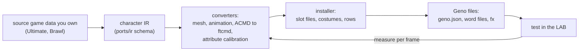

# Packet 9: Going further (outline)

**Status: outline.** Overview and pointers. The pipeline needs source-game data you must own, and
this course did not run it.

**Goal:** see how a whole move set from another game becomes a Geno fighter, and the rule the project
uses to judge it.

**Prerequisites:** packets 0 to 3.

## The shape of the pipeline

The tools live in `ports/`. `ports/README.md` is the entry point. In short:

For an Ultimate fighter, `ports/ir/tools/install_ultimate.py` is the driver. Its docstring lists
what it does: builds the m-ex slot files (a row cloned from a host fighter, with the menu archives
to match), takes the host's fighter data and scripts, exports and builds each costume, converts each
animation clip and points each motion row at the clip of the same action name, plans parts and
hurtboxes, maps script bones, and writes expression visibility (steps 1 to 8 of the docstring).
`acmd_to_ftcmd.py` translates the source game's move scripts into Melee ftcmd and Geno escapes, with
the rule that unsupported values fail unless reviewed and every loss is recorded in
`conversion_losses.json`. Check each installer's `--help` for the current switches.

Geno content for the specials is generated, not hand-written: `trail_magic_geno.py` and
`trail_specials_geno.py` write the profile; `ultimate_vfx_geno.py` imports effects;
`trail_fx_bindings.py` binds them to states.

Meta Knight (Halberd) has its own Brawl pipeline in `ports/halberd/` (`README.md` there; research
only, nothing from the game in the repository). Ultimate Kirby is a proof of life of the same
approach on Melee Kirby (`ports/kirby-ultimate/README.md`).

## The fidelity rule

The project's rule for porting a move set is: **fidelity means the source game's own logic, measured
per frame. Do not eyeball it.**

- Take the move from the source game's **status code** (its state machine), not from how it looks.
  Where the recovered logic is exact and where it is approximated is stated per feature in
  `melee/docs/geno.md` section 16.4. The Sonic Blade design, derived from the status code, is
  in `_research/ultimate-sonic-blade-spec-2026-10-03.md`.
- Measure the result frame by frame in the LAB and compare with the source's numbers:
  `ports/ir/tools/framedata_check.py` compares a LAB export with hitboxes compiled from the source
  script; `check_hitbox_positions.py` checks installed hitbox positions against the converted pose.
- Record every loss. `conversion_losses.json` and `hitbox_positions.json` are written by the
  installer. A fallback clip, an approximate host feature or a skipped audit (`--skip-acmd-audit`) is
  **not** source-game parity (`ports/README.md`).
- Calibrate ambiguous conversions on fighters that exist in both games. Do not guess.
- Melee's global rules stay Melee's (`melee/docs/geno.md` section 1). You port the fighter, not the
  engine.

## What this means for you

If your fighter comes from nowhere (it is your own design), none of the pipeline applies. Use
packets 1 to 8. If you want to port from Ultimate or Brawl, you need your own copies of those games,
the tools' dependencies (Python packages, a C# build for `fighterbuild`), and patience: Sora's
completeness "is defined by the generated audits, not by the install succeeding" (`ports/README.md`).

## Sources

- `ports/README.md`, `ports/CLAUDE.md`, `ports/ir/README.md`, `ports/halberd/README.md`,
  `ports/kirby-ultimate/README.md`.
- `ports/ir/tools/install_ultimate.py` (docstring), `acmd_to_ftcmd.py` (docstring),
  `framedata_check.py`, `check_hitbox_positions.py`, `trail_magic_geno.py`.
- `melee/docs/geno.md` sections 1, 16.4, 19.12 and 20.
- `_research/ultimate-sonic-blade-spec-2026-10-03.md`.
